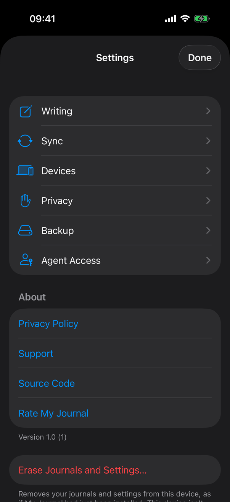
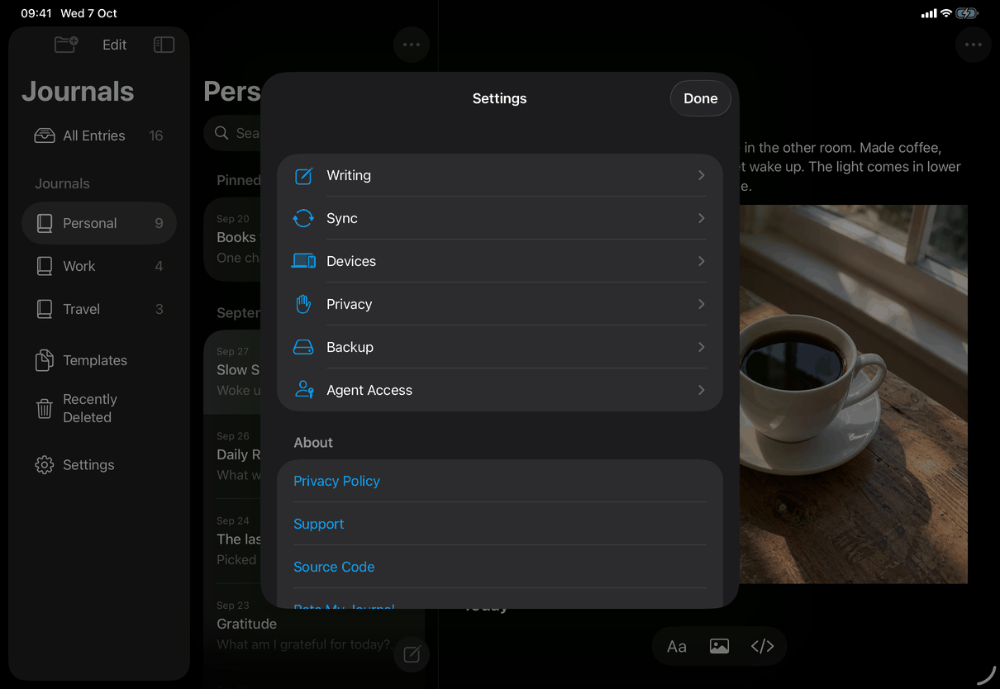

# Settings (Apple)

Neutral spec: [screens/settings.md](../../../screens/settings.md). Conventions: [platform.md](../platform.md#10-settings). This page is the container; each pane has its own page: `settings-general`, `settings-sync` (with its Devices section, `settings-devices`), `settings-privacy`, `settings-backup`, `settings-agent-access`, plus `settings-about` and `settings-erase`.

The two shells are different controls, not one layout at two sizes. iPhone and iPad show a sheet with a navigation list (General, Sync, Privacy, Backup, Agent Access, then the About and Erase sections). The Mac shows a separate Settings window with five tabs (General, Sync, Privacy, Backup, Agent Access), in the same order; its General tab holds the default journal, the Markdown switch and the Erase button, and it has no About section and no Done button. One SwiftUI view, `SettingsView`, builds both, switching on `#if os(macOS)`.

## Controls

Model: `AppModel` (`settingsPresented`, `settingsTab`, `settingsRequestedTab`, `locked`, `showsLibraryProblem`). Every pane body is a `Form` with `.formStyle(.grouped)`.

**Root (`SettingsView.body`).** A `Group` that shows, in order of precedence:
1. Locked (`model.locked`): one secondary-coloured `Text`, copy key `settings.locked`, with padding. Nothing else is built.
2. Library problem screen showing (`model.showsLibraryProblem`): one secondary `Text`, copy key `settings.libraryProblem` ("Settings are available once your journals open."), the spec's library problem state. **Screenshot pending:** settings-library-problem.
3. Otherwise the shell below.

**iPhone and iPad shell.**
- `NavigationStack(path: $panes)` with a `List` as root. `panes` is `[AppSettingsTab]`; a requested pane is pushed by setting it. The navigation title is `settings.title`, `.navigationBarTitleDisplayMode(.inline)`. The sheet is `.sheet(isPresented: $model.settingsPresented) { SettingsView() }` on `RootView`.
- Section 1: five `NavigationLink(value: tab)` rows, each a `Label` with an SF Symbol: General `gearshape` (`settings.pane.general`), Sync `arrow.triangle.2.circlepath` (`settings.pane.sync`), Privacy `hand.raised` (`settings.pane.privacy`), Backup `externaldrive` (`settings.pane.backup`), Agent Access `person.badge.key` (`settings.pane.agents`). The pushed pane's inline title is the same word (`navigationDestination(for:)` with `.navigationTitle`).
- Section 2: `AboutSection` (iOS only): see `settings-about`.
- Section 3: `EraseSection`, a section of its own: see `settings-erase`.
- Toolbar: one `ToolbarItem(placement: .confirmationAction)` `Button("Done")` (`common.done`, command `settings-done`) calling `dismiss()`.
- A pane pushed from outside: `onAppear` reads `model.settingsRequestedTab`, sets `panes = [tab]` and clears the request, so the list is underneath and the pane is on top. Only `openSyncSettings()` (Sync Status ▸ Sync Settings…) sets it.

**Mac shell.**
- A `Settings { SettingsView().environmentObject(model) }` scene in `JournalApp.swift`. The system supplies the My Journal ▸ Settings… item and ⌘, (`open-settings`).
- `TabView(selection: $model.settingsTab)` whose children carry `.tabItem { Label(title, systemImage:) }`: General `gearshape`, Sync, Privacy, Backup and Agent Access with the same symbols as the iPhone list. The window title is the selected tab's name (standard Settings scene behaviour). Tab titles are the English words in the view.
- Opening it from code (Sync Status, Show Connection): `SettingsPresenter` (a zero-size `Color.clear` in the journal window's `.background`) watches `model.settingsPresented`, calls `openSettings()` (the `\.openSettings` environment action, macOS 14 and later) and resets the flag; `showSettingsWindow:` is the fallback below macOS 14. The tab to show is set first: `openSyncSettings()` sets `settingsTab = .sync`; the journal window's "Show Connection" notice (`Views/SaveFailureNotice.swift`) sets `.sync`, where the Connect to a Server sheet it brings forward belongs.
- `model.settingsTab` is an `AppModel` property, so the window reopens on the last selected tab for the life of the process. Its initial value is `.general`.

**Sheets owned by the Settings view on both platforms:** `.sheet(item: $connect, onDismiss:) { ConnectionView() }` (Connect to a Server and Reconnect, opened by the Sync pane; its `onDismiss` raises `devicesReload`, which makes the Devices section read its list again; Agent Access has its own sheet).

**States.**
- Empty: no pane has an empty state of its own here; the Privacy pane builds nothing when `model.configuration` is nil (just after Erase, while Settings closes).
- Error: none at this level. Panes show their own.
- Locking while Settings is open: iPhone and iPad close the sheet (`RootView.closePresentations()` sets `settingsPresented = false`); the Mac window stays open and shows the locked text.
- After Erase Journals and Settings (`closeAfterErasing()`): Mac, if `model.hasJournalWindow` is false, `openWindow(id: JournalApp.windowID)` first, then `dismiss()`; iPhone and iPad `dismiss()`, then 600 ms later `JournalAccessibility.screenChanged()` (a `UIAccessibility` screen-changed notification) so VoiceOver lands on the first-launch screen.

## Layout

- **iPhone (compact width).** The sheet is the system's page sheet covering the screen below the status area; the list is a single column of grouped rows. The entry point is a toolbar button at the top left of the Journals screen (`CompactJournalNavigation`, `ToolbarItem(placement: .topBarLeading)`, `Label("Settings", systemImage: "gearshape")`). The Erase section is below the fold; scroll to reach it.
- **iPad (regular width).** The same sheet, drawn by the system as a centred form sheet (about 580 by 650 points in the capture) over the three-column library. The entry is the last row of the journals sidebar (`JournalSidebarView`, `#if os(iOS)`, a `Button` with `Label("Settings", systemImage: "gearshape")`). While the sidebar is in edit mode that row is replaced by a dimmed, disabled `Label`. In the capture the About section is cut off at the sheet's bottom edge: the list scrolls. In compact width on iPad (Slide Over, narrow Stage Manager window) or at accessibility Dynamic Type sizes, `RootView.usesStackedNavigation` is true and the entry point is the iPhone's top-left button instead. How the system sizes the sheet in those widths is system behaviour and was not captured.
- **Mac.** A window titled by the selected tab. Each tab pane is `.frame(width: 560)` with `.frame(minHeight: 440 (General: none), maxHeight: min screen height minus 120, alignment: .top)` and `.fixedSize()`, so the window resizes to each tab (as Apple's own Settings windows do) and longer content scrolls. The Sync tab alone has one height, `min(640, screen height minus 120)` (`syncPaneHeight`, `paneContent(_:)`), because it gains and loses sections (Devices, Changed on Two Devices) as the connection changes and the device list arrives, and the window must not jump; it scrolls inside that height. The 440-point minimum keeps sheets (Connect to a Server, Add Device, the password check) inside the window. `BouncesOnlyWhenScrollable` applies `.scrollBounceBehavior(.basedOnSize)` so a pane that fits does not rubber-band. The window opens independently of the journal window.
- **Dynamic Type.** Standard `List` and `Form` rows grow and wrap; no custom layout in this file. At accessibility sizes the stacked navigation of the library applies, not a change inside Settings.

## Commands and shortcuts

| Command | Placement | Shortcut | Enabled when |
| --- | --- | --- | --- |
| `open-settings` | as in [commands.md](../commands.md): Mac application menu (system item), iPhone Journals screen top left, iPad last sidebar row | ⌘, on the Mac (system) | always; the iPad row is dimmed in journal edit mode |
| `settings-open-pane` | Mac tab, iPhone and iPad list row | none | always |
| `settings-done` | iPhone and iPad toolbar, confirming position; none on the Mac | none | always |
| `sync-status` | its Sync Settings… button opens Settings at Sync | none | when sync needs the person |

Keyboard: on iPad with a hardware keyboard, the list is reachable with arrow keys and Full Keyboard Access like any `List`; there is no app-specific shortcut. On the Mac the tabs are the system's Settings tab bar; the page adds no key handling. Escape closes a sheet presented from Settings, not the Settings window itself (sheet default).

## Copy differences

- `settings.pane.general`: "General" on every device (the `mac` variant went in 1.1).
- Pane titles in the view are literal English strings, not catalog lookups; they equal the catalog's default text.
- Sentence case for controls inside Mac forms is covered on `settings-general` and `settings-privacy`.

## Accessibility

- Each row and tab is a `Label` (icon plus text); the symbol is decorative to VoiceOver. No explicit `.accessibility*` modifiers in `SettingsView`.
- The iPhone toolbar button and the iPad sidebar row are a `Label("Settings", ...)`, so VoiceOver reads "Settings". The dimmed row in edit mode is `.disabled(true)`.
- After Erase, VoiceOver is moved to the first-launch screen 600 ms after the sheet closes, because the sheet's dismissal would otherwise leave focus on nothing.
- Pane section headers are `Section` headers, read as headers by the system.
- Increase Contrast, Reduce Transparency and Reduce Motion are handled by the system's list, form and sheet styles; the file has no overrides.

## Differences between iPhone, iPad and Mac

- Sheet versus window: iPhone and iPad are modal over the library, because a sheet is the iOS idiom; the Mac uses the Settings scene so it opens alone and can stay open with no journal window (`open-settings`, ⌘,).
- List versus tabs: pushed `NavigationLink` rows on iOS; toolbar tabs on the Mac, as System Settings and Apple's Mac apps do.
- The first pane is General on every device. Erase Journals and Settings… is its own last section on iOS but the last group of General on the Mac, as iOS Settings and System Settings each end General with Transfer or Reset (owner decision: not inside General on iPhone and iPad).
- About exists only on iPhone and iPad (`AboutSection` is `#if os(iOS)`); on the Mac it is in the Help menu.
- Done exists only on iOS, where a sheet needs an explicit close; the Mac window has its close button.
- A requested pane is pushed on iOS (`settingsRequestedTab`, consumed once) and selected on the Mac (`settingsTab`, kept).
- Locking closes the sheet on iOS; the Mac window stays and shows the locked text.

## Screenshots

| State | iPhone | iPad |
| --- | --- | --- |
| Settings list, light. The pane rows (five since 1.1; this capture predates the change and shows Writing and Devices), the About section with the version, the Erase section starting at the bottom edge |  |  |
| Settings list, dark |  |  |

The iPad captures show the sheet over the library with the sample journals; its list is cut off after Source Code and Rate My Journal. The Mac captures are on each pane's page (`settings-general`, `settings-privacy`, `settings-backup`).

## Source files

View:
- `apps/apple/JournalApp/Views/SettingsView.swift`: the shell for both platforms, the pane switch, tab and row definitions, `closeAfterErasing()`, the macOS pane sizing.
- `apps/apple/JournalApp/Views/SettingsPresenter.swift`: opens the Mac Settings window from code.
- `apps/apple/JournalApp/Views/RootView.swift`: the iOS `.sheet`, the Mac presenter, `closePresentations()`.
- `apps/apple/JournalApp/Views/JournalSidebarView.swift` and `CompactJournalNavigation.swift`: the iPad row and the iPhone button.
- `apps/apple/JournalApp/JournalApp.swift`: the `Settings` scene.

Model:
- `apps/apple/JournalApp/Model/AppModel.swift`: `AppSettingsTab`, `settingsPresented`, `settingsTab`, `settingsRequestedTab`.
- `apps/apple/JournalApp/Model/SyncHealthOperations.swift`: `openSyncSettings()`.

Design records: `docs/design/owner-decisions-2026-09-25.md`, `ios-delete-all-and-settings-2026-10-03.md`, `erase-device-2026-10-04.md`, `about-and-ratings-2026-10-05.md`, `client-only-mac-lists-markdown-2026-10-05.md`.

## Open questions

See [open-questions.md](../../../open-questions.md), A30: the question says the Mac window opens on Sync, but the current code initialises `settingsTab` to `.general`, so the item looks resolved and the spec's Rules text is out of date. The library-problem text is now `settings.libraryProblem` in the spec.
