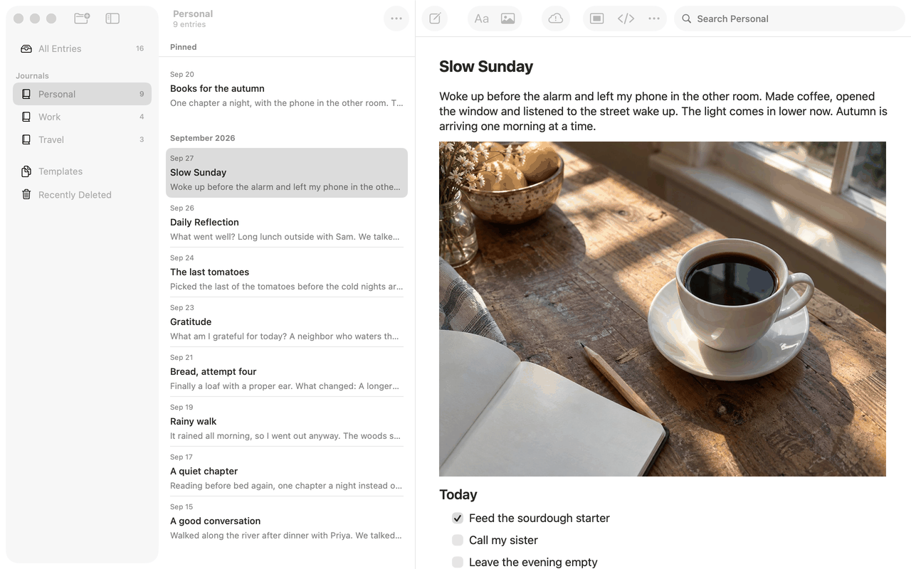

# Sync Status (Apple)

A control that appears only when sync needs the person. It is a SwiftUI `Menu` inside the Entry Actions menu on iPhone and iPad (`syncMenu` in `Views/RootView+Toolbar.swift`) and an AppKit toolbar item on the Mac (`syncStatus` in `Views/Mac/JournalToolbarController.swift`). Both read the same `AppModel` properties. Spec: [sync-status](../../../screens/sync-status.md). Toolbars and menus: [platform.md](../platform.md#4-menus-and-toolbars). States and messages: [sync-recovery](../flows/sync-recovery.md).

## Controls

**When it shows** (`AppModel.showsSyncStatus`, `Model/SyncHealthOperations.swift`): `connection != nil && (syncNeedsAttention || syncLongWait)`. `syncNeedsAttention` is true when `syncHealth` is not a `.temporary` kind, or, with no sync failure, when `syncError != nil` (a record or image the server refused). `syncLongWait` is updated after every sync by `updateSyncLongWait()`: pending changes, the last sync failed, and more than `longSyncWait` (24 hours) since `syncActivity.lastSynced`, or since `syncTiming.failingSince` when the connection never synced. Temporary states (`.offline`, `.unreachable`, `.unavailable`, `.localDataUnavailable`) therefore stay hidden until the long wait. `lockImmediately()` clears `syncError` only when there is no sync state (an item-level message can name an entry); a state's message stays, so the control follows the same rule after unlocking.

**Menu contents.** The same three items on every device:

1. The message, a non-interactive item: `model.syncError ?? "Saved on this device. Waiting to sync."` (`syncStatusMessage`; `messages.sync.waiting` is the fallback). `syncError` is `SyncHealth.message(host:)` for a state or the engine's item-level problem text (`messages.sync.recordTooLarge`, `messages.sync.recordRefused`, `messages.sync.imageTooLarge`, `messages.sync.imageRefused`).
2. One action, titled `model.syncStatusAction.title` (`messages.sync.action.syncNow`, `common.tryAgain`, `messages.sync.action.checkAgain`, `messages.sync.action.setUpServerAgain`, `messages.sync.action.connectAgain`, `common.signIn`). Its closure is `model.perform(action) { model.encryption.signInRequested = true }`: a non-connecting action runs `syncNow()` (the same code as Settings ▸ Sync, including the half-second minimum and the VoiceOver announcement); a connecting action sets `signInRequested`, which presents `ConnectionView` as a sheet over the journal window through `EncryptionPresentation` ([reconnect-to-server](../flows/reconnect-to-server.md)).
3. `messages.syncStatus.settings` (Sync Settings…), calling `model.openSyncSettings()`: Mac, `settingsTab = .sync` then `settingsPresented = true` (the Settings window opens on its Sync tab); iPhone and iPad, `settingsRequestedTab = .sync` then `settingsPresented = true` (the Settings sheet opens already pushed to Sync).

The label, tooltip and accessibility label are `messages.syncStatus.title`; the symbol is `exclamationmark.icloud` (SF Symbols), always. There is no busy state in the control; a sync the person started shows "Syncing…" only in Settings ▸ Sync ([settings-sync](settings-sync.md)).

**iPhone and iPad.** `entryMenu` in `Views/RootView.swift` is the Entry Actions `Menu` (`Label("Entry Actions", systemImage: "ellipsis")`, `.menuIndicator(.hidden)`) in the editor's `.primaryAction` toolbar group. Under `#if os(iOS)` it ends with `syncMenu`: `if model.showsSyncStatus { Menu { Text(message); Button(action.title) {...}; Button("Sync Settings…") {...} } label: { Label("Sync Status", systemImage: "exclamationmark.icloud") }.iconHelp("Sync Status") }`, which the system draws as a submenu after the entry's actions. The whole Entry Actions menu is `.disabled(model.draft == nil || model.draft?.kind == "journal")`, so Sync Status is reachable only with an entry or template open. No toolbar button is added or removed.

**Mac.** `JournalToolbarController` is the window's `NSToolbar` delegate. The layout (`layout`) adds `("syncStatus", .syncStatus), ("syncSpace", .space)` between the second flexible space (after Insert Image) and Editor Only's group whenever `configuration.syncs` (`model.connection != nil`); `syncItems()` inserts or removes both items when a connection is made or stopped, so a library without a server has no gap. The item is an `NSToolbarItem` whose `view` is `syncStatusSlot`, an `NSView` that always holds the button, sized to it, so showing or hiding the button never moves another item. The button is `MenuToolbarButton` (`bezelStyle = .toolbar`, image only, `toolTip` and accessibility label `messages.syncStatus.title`, accessibility role `.menuButton`); `showSyncStatus(_:)` hides it and sets the item's `isBordered` to false (so an empty place draws no glass) or shows it with a border; it fades in over 0.2 seconds unless Reduce Motion is on. The menu (`menuNeedsUpdate`) is built at open time: the message as a disabled `NSMenuItem`, the action, Sync Settings…. It opens on mouse-down, `performClick` (keyboard, VoiceOver) or Space. The item has `visibilityPriority = .low`, so it is the first to leave a narrow toolbar, and `menuFormRepresentation` is a hidden-unless-shown "Sync Status" `NSMenuItem` with the same submenu, which is the overflow menu's form. `RootView+MacWindow.swift` fills `JournalToolbarConfiguration.syncStatus` (message and action title) when `showsSyncStatus`.

## Layout

- **iPhone (compact):** the submenu is the last group in the "…" menu of the editor's navigation bar. The editor is pushed on iPhone, so Sync Status exists only while an entry is open.
- **iPad:** the same menu in the editor column's toolbar of the three-column window. Also only with an entry open.
- **Mac:** a toolbar item in the journal window, right of Insert Image's flexible space and left of Editor Only, as in the order described above; in the toolbar overflow when the window is too narrow.
- Dynamic Type: the item is a toolbar icon and system menu; wrapping of the message in the menu is the system's.

## Commands and shortcuts

| Command | Placement | Shortcut | Enabled when |
| --- | --- | --- | --- |
| `sync-status` | Toolbar item (Mac); Entry Actions submenu (iPhone, iPad), as in [commands.md](../commands.md) | none | `showsSyncStatus`; on iPhone and iPad also an entry open |
| `sync-now` | Action row (titles Sync Now, Try Again, Check Again) | none | the state's action is non-connecting |
| `sync-reconnect` | Action row (titles Set Up Server Again…, Connect Again…, Sign In…) | none | the state's action connects |

Sync Settings… has no command id of its own in `commands.md`; it is the menu's last row. No menu bar command and no keyboard shortcut. Keyboard: the Mac button opens its menu from the mouse-down and from `performClick` (keyboard activation and VoiceOver), and the menu then follows the system's arrow-key navigation; whether Full Keyboard Access reaches the toolbar item was not run.

## Copy differences

None. The three texts come from the same properties on all devices. (`syncStatusMessage`'s fallback "Saved on this device. Waiting to sync." is `messages.sync.waiting`.)

## Accessibility

- The Mac button is `NSAccessibility` role menu button labelled `messages.syncStatus.title`; the symbol carries the same description.
- The message is the menu's first item, so VoiceOver reads it first.
- Results are announced only for actions the person started: `syncNow()` posts `JournalAccessibility.announce(syncError ?? (synced ? "Synced" : "Couldn’t sync."))` (`messages.sync.announce.synced`, `messages.sync.announce.failed`). Automatic syncs and state changes are never announced.
- Reduce Motion: the Mac button appears without the fade. Nothing else moves.
- Increase Contrast and Reduce Transparency: standard toolbar button and menu, nothing to adapt.

## Differences between iPhone, iPad and Mac

- Mac: its own toolbar item with a fixed-width place and overflow behaviour, because a toolbar that rearranged itself when a status appeared would move the controls under the pointer. iPhone and iPad: a submenu of an existing menu, because their bars have no room for a conditional button and no layout to keep stable.
- iPhone and iPad: reachable only with an entry open (the Entry Actions menu is disabled otherwise); the Mac button is reachable whenever the journal window shows and the library syncs.
- Connect actions present Connect to a Server over the journal window on all three; on the Mac the journal window then also shows the pause notice ([connect-to-server](connect-to-server.md)).

## Screenshots

None. No capture exists: the control is hidden unless sync needs the person, and the sample-library captures show a healthy connection or no connection. What it looks like: a toolbar button on the Mac showing a cloud with an exclamation mark, opening a menu with one line of text, one action and "Sync Settings…"; on iPhone and iPad a "Sync Status" row with the same icon at the bottom of the "…" menu.

-  Mac: the journal window while the server was replaced: Sync Status in the toolbar asks the person to act.

## Source files

View:
- `apps/apple/JournalApp/Views/RootView+Toolbar.swift`: `syncMenu` and `syncStatusMessage` (iPhone and iPad).
- `apps/apple/JournalApp/Views/RootView.swift`: `entryMenu`, where `syncMenu` ends the Entry Actions menu.
- `apps/apple/JournalApp/Views/Mac/RootView+MacWindow.swift`: fills the Mac toolbar configuration (`syncs`, `syncStatus`, actions).
- `apps/apple/JournalApp/Views/Mac/JournalToolbarController.swift`: the Mac toolbar item, slot, overflow form, menu, fade.
- `apps/apple/JournalApp/Views/SyncNowRows.swift`, `apps/apple/JournalApp/Views/SettingsView.swift`: the same message and action in Settings ▸ Sync.

Model:
- `apps/apple/JournalApp/Model/SyncHealthOperations.swift`: `showsSyncStatus`, `syncNeedsAttention`, `syncLongWait`, `syncStatusAction`, `perform`, `openSyncSettings`.
- `apps/apple/JournalApp/Model/SyncSchedule.swift`: `syncNow()`, automatic pace, `SyncActivity`.
- `apps/apple/JournalApp/Model/AppModel.swift`: `sync(...)` records health, `syncError`, `syncFailed`.

Core:
- `apps/apple/Packages/JournalCore/Sources/JournalCore/SyncHealth.swift`: states, kinds, messages.

Design records: [sync-health-and-recovery.md](../../../../docs/design/sync-health-and-recovery.md), [quiet-sync-and-title-alignment.md](../../../../docs/design/quiet-sync-and-title-alignment.md), [sync-now-and-done.md](../../../../docs/design/sync-now-and-done.md).

## Open questions

See [open-questions.md](../../../open-questions.md). The spec already records that iPhone and iPad reach Sync Status only with an entry open. Not run: the exact way the system draws the message item inside the iOS submenu.
