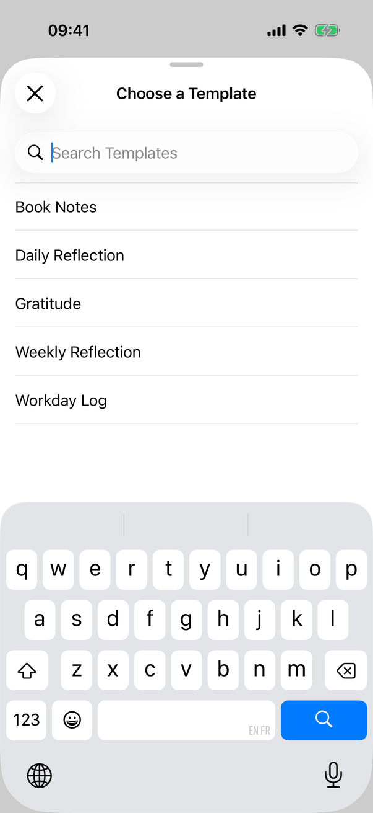
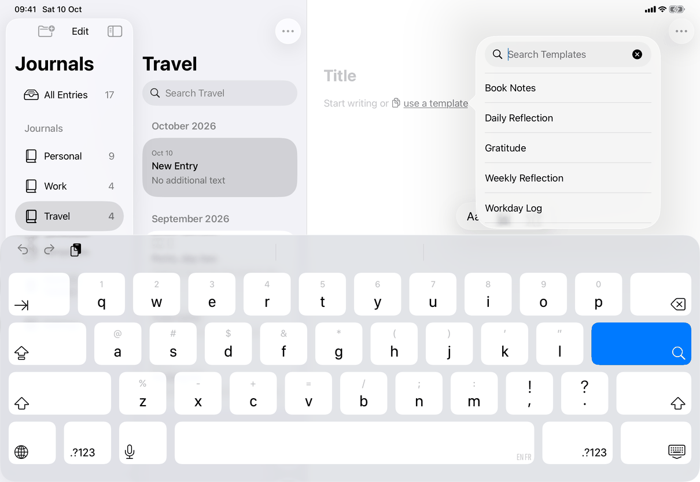
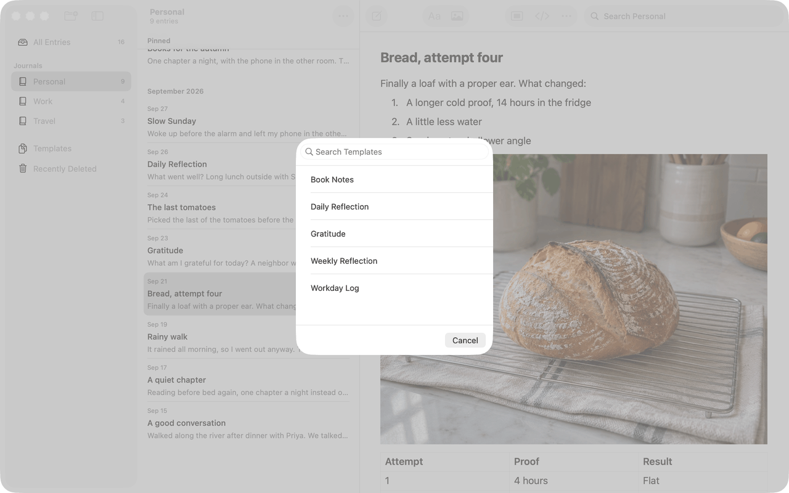

# Template chooser (Apple)

Implements [screens/template-chooser](../../../screens/template-chooser.md). One SwiftUI view, `TemplateChooserView`, is shown in four containers depending on how it is opened and on the device. It chooses a template for the entry that is open and fills it; it never creates an entry and has no journal picker. It is part of [new-entry](../flows/new-entry.md); the Templates list is [templates](templates.md).

## Controls

**Entry points and containers**

| Opened by | iPhone | iPad | Mac |
| --- | --- | --- | --- |
| File ▸ Use a Template… (`model.templateChooserPresented`, "the chooser for the open entry") | not reachable (no menu bar) | `.sheet` in `RootView`, not anchored | `.sheet` in `RootView`, not anchored, 320 wide by 352 |
| The link in an empty entry's placeholder | `.sheet` with `.presentationDetents([.medium, .large])` | `.popover` in regular width, the sheet in compact width | `NSPopover` through `ToolbarPopover`, 320 by 300, no animation |

- **File menu item** (`use-a-template`). `AppCommands` sets `model.templateChooserPresented = true` inside a `Transaction` with `disablesAnimations`, after `inJournalWindow` (which reopens the Mac window). `RootView` presents `TemplateChooserView()` for the open entry. The item is dimmed, not hidden, unless `TemplateSuggestion.resolve` allows the link: the same condition as the link, so the two are enabled together. It replaces File ▸ New Entry from Template… of 1.0 and takes its place in the iPad ⌘-hold overlay. `closePresentations()` dismisses the sheet when the app locks.
- **The link.** The words "Start writing or use a template" are text drawn by the editor (`PlaceholderText` in `Editor/EditorPlaceholder.swift`: the prefix, the symbol `doc.on.doc` as a text attachment, the underlined words, with non-breaking spaces so the link stays on one line unless it is wider than the column). `RootView.entryEditor` gives the editor a `suggestion` view when `TemplateSuggestion.resolve` allows it (an entry, an editable template exists, the body has no text and no images, editing is possible), and the editor places a transparent button over the link's glyphs. `TemplateSuggestionView` is that button: on iOS a `Button` with `Color.clear.contentShape(Rectangle())`, `.hoverEffect(.automatic)` and the accessibility label `library.templateChooser.useTemplate`; on the Mac a `PopoverButton` (an `NSButton` with `isTransparent = true`) with the same label. iOS decides popover or sheet when it opens, from `horizontalSizeClass == .regular`, and a size-class change closes a popover instead of turning it into a sheet. Opening and closing run in a `Transaction` without animation, as the formatting controls do. The Mac popover is `ToolbarPopover(initialFocus: .searchField)`: transient `NSPopover`, `animates = false`, content built once and reused; `TemplateChooserPresentation.generation` is bumped when it closes so the next opening starts without search text, highlight or error, and After a choice the title takes focus; after Escape or Cancel focus returns the way it came (`ToolbarPopover.CloseReason`). The popover has no visible title (see Open questions).

**Contents of the view (`chooser`)**

1. **Search field**: `TemplateSearchField`, placeholder `library.search.templates`. Mac: an `NSSearchField` subclass that becomes first responder once when it joins the window, with its placeholder hidden while text exists; keys come through `control(_:textView:doCommandBy:)`: `moveDown`, `moveUp`, `insertNewline` (create) and `cancelOperation` (close), all ignored while an input method has marked text (`hasMarkedText()`), so composing is not interrupted. iOS: a `UISearchBar` (`.minimal`) subclass, becomes first responder once, `autocorrectionType = .no`, `autocapitalizationType = .none`, `enablesReturnKeyAutomatically = false` (so Return creates before any typing once a row is highlighted), `maximumContentSizeCategory = .accessibilityMedium`; hardware Up, Down and Escape are `UIKeyCommand`s with `wantsPriorityOverSystemBehavior`, again ignored while `markedTextRange` is set. The search matches template names with `localizedCaseInsensitiveContains`.
2. **List**: `List` in `.listStyle(.plain)` of `Button`s; each row is `Text(name)` with `minHeight: 44`, `.contentShape(Rectangle())`. The highlighted row is drawn by hand (`listRowBackground` and the text color: `selectedContentBackgroundColor` and `alternateSelectedControlTextColor` on the Mac, accent and white on iOS) and has `.accessibilityAddTraits(.isSelected)`. The list scrolls to the highlight (`ScrollViewProxy`). Choices are `model.templates` whose `document.isEditable` is true, named by `displayTitle`; templates with the same name get `(` plus the first eight characters of the template's identifier plus `)` appended (`library.templateChooser.duplicateName`). Empty: `library.entryList.empty.noTemplates` when there are no choices, `library.entryList.empty.noResults` when the filter leaves none, as the first row of the list. On iOS the field is pinned above the list with `safeAreaBar(edge: .top)` (iOS 26) or `safeAreaInset(edge: .top)` with a `.bar` background, and `scrollDismissesKeyboard(.interactively)` lets a drag hide the keyboard.
3. **Error**: `Text(error).foregroundStyle(.red)` below the list (only `library.templateChooser.templateGone`).
4. **Close.** iOS sheets (not anchored): `NavigationStack` with an inline title `library.templateChooser.title` and a `.cancellationAction` item, `Button(role: .cancel)` on iOS 26 (drawn as the system's X; the iPhone screenshot) and `Button("Cancel")` before. The Mac sheet: a `Divider` and a trailing `Button("Cancel", role: .cancel)` (`common.cancel`) at the bottom, plus `.onExitCommand` so Escape works anywhere in the sheet. The anchored popovers have no button.

**Choosing.** A row tap sets `selected` and calls `create()`; Return in the field calls `create()` and does nothing unless the highlighted row is in the filtered list; Up and Down (`moveSelection`) start at the first row (Down) or the last (Up) when nothing is highlighted and stop at the ends. `create()` validates, then asks the model to fill the open entry (`fillEmptyEntry(with:)`): one undoable change to the body, the title kept and focused if empty. If the body is no longer empty in the editor or in storage nothing changes, the chooser closes and the general error alert shows `library.templateChooser.entryChanged`; if the entry was closed or deleted meanwhile the chooser just closes. The only inline error is `library.templateChooser.templateGone` (also when the highlighted template leaves, via `.onValueChange(of: choices)`). `close()` finishes with the AppKit close closure (Mac popover) or `dismiss()` in a transaction without animation.

## Layout

- **Mac.** Sheet 320 wide, 352 tall: search field (44 tall, 8-point margins), Divider, list, Cancel row. Popover 320 by 300 with the same contents minus the Cancel row.
- **iPad.** Popover from the link, 320 wide, ideal height 360, which shrinks instead of clipping the field when the keyboard leaves less room. The File menu sheet and the compact-width sheet use the iPhone's contents.
- **iPhone.** A sheet with the detents medium and large (`presentationDetents([.medium, .large])`); the screenshot, taken with the keyboard open, shows the grabber, title, pinned field, rows and keyboard.
- **Dynamic Type.** Rows grow beyond 44 points with the text size; the search bar's own text stops growing at `accessibilityMedium` so results stay visible beside the keyboard, also on a small iPhone in landscape.

## Commands and shortcuts

| Command | Placement | Shortcut | Enabled when |
| --- | --- | --- | --- |
| `use-a-template` | File ▸ Use a Template… (Mac, iPad), and the link in an empty entry; as in [commands.md](../commands.md) | none | An entry body with no text or pictures, editable, and an editable template exists (the menu item is dimmed otherwise) |

Keyboard (all with the field focused): typing filters; Down and Up move the highlight; Return chooses; Escape closes unless an input method is composing (a composing Escape belongs to the input method). On the Mac Escape also works after tabbing to Cancel (`.onExitCommand`). The spec's keyboard order is search field, list, Cancel; the code adds no focus order of its own beyond focusing the search field first.

## Copy differences

None. `library.menu.file.useTemplate` and `library.templateChooser.popoverTitle` have the same text (listed in `copy/same-wording.json`).

## Accessibility

- The link reads `library.templateChooser.useTemplate` (it is a button over drawn text, so the label is set on the button, not read from the text).
- The highlighted row has the selected trait. The File menu item reads `library.menu.file.useTemplate`.
- The Mac popover takes focus into its search field every time it opens (`initialFocus: .searchField`) and posts a focus notification; when it is dismissed with Escape after being opened from the keyboard or VoiceOver, focus returns to the link's button. Opened with the mouse, the editor's text keeps its focus.
- Pointer: `.hoverEffect(.automatic)` on the iPad link.
- Reduce Motion: the chooser opens and closes without animation for everyone, because it is a writing-time panel.

## Differences between iPhone, iPad and Mac

- **Container.** iPhone: always a sheet (a phone has no room beside the text). iPad: popover in regular width, sheet in compact width (decided when it opens). Mac: popover from the link, sheet from the File menu; the sheet has a Cancel button because a sheet needs a way out.
- **Cancel.** iOS sheets have a navigation bar Cancel (X on iOS 26); the Mac sheet has Cancel at the bottom, as Mac sheets do. Popovers have none.
- **File menu path** exists on Mac and iPad only, where there is a menu bar.
- **Search field** is an `NSSearchField` on the Mac and a `UISearchBar` on iOS, with the same key behaviour implemented in each toolkit.

## Screenshots

| Device | State |
| --- | --- |
| iPhone |  |
| iPad |  |
| Mac |  |

The iPad capture shows a system keyboard-introduction panel under the popover; it is not part of the app.

## Source files

View:
- `apps/apple/JournalApp/Views/TemplateChooserView.swift`: the chooser, `TemplateChooserPresentation` (reset for the reused Mac popover).
- `apps/apple/JournalApp/Views/TemplateSearchField.swift`: the search field in AppKit and UIKit, and its keys.
- `apps/apple/JournalApp/Views/TemplateSuggestionView.swift`: the link's button, popover or sheet on iOS, `NSPopover` on the Mac.
- `apps/apple/JournalApp/Views/MacFormattingButton.swift`: `ToolbarPopover`, `PopoverButton`.
- `apps/apple/JournalApp/Editor/EditorPlaceholder.swift`: the placeholder text and its link.
- `apps/apple/JournalApp/Views/RootView.swift`, `AppCommands.swift`: the File menu sheet and item.

Model:
- `apps/apple/JournalApp/Model/TemplateSuggestion.swift`: when the link shows, `fillEmptyEntry(with:)`.
- `apps/apple/JournalApp/Model/AppModel.swift`: `templateChooserPresented`.

Core: `JournalDocument.isEditable` and `JournalNames` in `apps/apple/Packages/JournalCore`.

Design records: `docs/design/new-entry-template-suggestion.md`, `docs/design/template-journal-choice-2026-10-03.md`.

## Open questions

See [open-questions.md](../../../open-questions.md), B45: the spec says the Mac popover is titled `library.templateChooser.popoverTitle`; in code the popover has no visible title, the string is only the internal name of its `ToolbarPopover` (its button's label is replaced by `library.templateChooser.useTemplate`).
