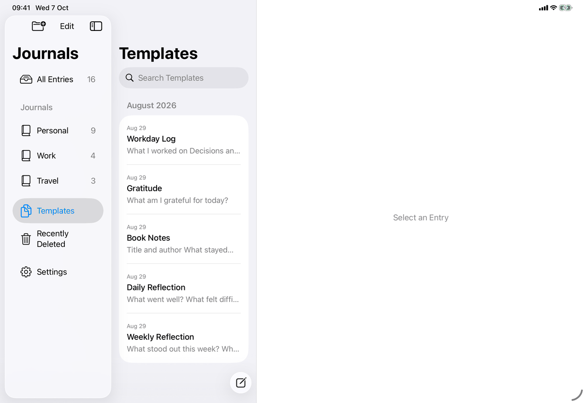
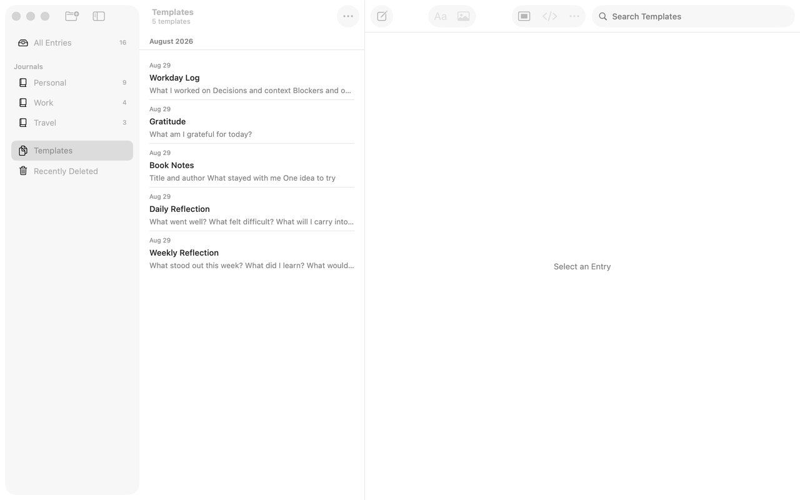

# Templates (Apple)

Implements [screens/templates](../../../screens/templates.md). Templates are shown by the same list view as entries ([entry-list](entry-list.md)), so this page records only what differs: the rows, the context menu and the empty state. A template is used from inside an empty entry ([template-chooser](template-chooser.md)); the flow is [new-entry](../flows/new-entry.md).

## Controls

- **Collection.** `JournalDestination.templates`; `AppModel.showingTemplates` makes `listedEntries()` return `kind == "template"` items that are not deleted, sorted by date newest first, ties by identifier. Notice that this order is not alphabetical, and templates created in the same second sort by id, so two devices can list the same templates in a different order (the three screenshots do). `model.templates` (sorted by title) is a separate property used by menus and the chooser. `entryGroups` has no Pinned group here (`showsPinnedSection` is false), only month sections.
- **Title.** iOS navigation title `library.journals.templates`; Mac window title the same and subtitle `common.templateCount` or `library.entryList.empty.noTemplates` (`collectionSubtitle`).
- **Row.** The shared `entryRow`: date, `displayTitle` (a blank template title shows the first line of its text, or the text for `library.entryList.untitledEntry`), one-line preview. No journal label and no pin state. The accessibility value is empty here (the value `library.entryList.templateValue` is used only for template rows inside Recently Deleted).
- **Opening.** `model.select(id)` as for entries; the template opens in the same editor (`NativeEditor`), editable when `canEdit` (`draft.kind == "template"`).
- **Context menu and Entry Actions** (`entryActionCatalog` with `entry.kind == "template"`): Image Descriptions… when it has pictures, Version History…, a separator and Delete Template (`library.entryActions.deleteTemplate`, `trash`, destructive). There is no New Entry In, no Pin, Change Date, Move or Save as Template.
- **Swipe.** Trailing `common.delete` as Delete Template through the same `delete(_:)` as entries, with Undo "Delete Template"; no leading swipe (`canPin` needs `kind == "entry"`).
- **Empty state.** `noTemplates` in `RootView`: a `VStack` of `library.entryList.empty.noTemplates` and `library.entryList.empty.noTemplatesHelp` (`.callout`, centered, `fixedSize` vertical so it wraps, with non-breaking spaces in "Save as Template" so the command's name stays on one line), combined into one VoiceOver element (`.accessibilityElement(children: .combine)`). Search without results: the common `library.entryList.empty.noResults` with `library.entryList.empty.clearSearch`. A new library starts empty.
- **Model.** `AppModel` (`templates`, `saveTemplate`).

## Layout

Same as [entry-list](entry-list.md): Mac middle column with lines between rows, iPad content column with grouped cards, iPhone a stacked page. Journal Actions is not shown over Templates on iPhone and iPad (it needs a journal); the Mac's Journal Actions menu holds New Journal… alone. New Entry in the bars still works and files an empty entry in the Default Journal.

## Commands and shortcuts

| Command | Placement | Shortcut | Enabled when |
| --- | --- | --- | --- |
| `entry-actions` | as in commands.md | | A template is open |
| `delete-entry` | as in commands.md | Mac: Delete or ⌘⌫ in the focused list | `offersDelete` |
| `entry-version-history`, `image-descriptions` | as in commands.md | | Version History always; Image Descriptions with pictures |
| `new-entry` | as in commands.md | ⌘N | Creates an empty entry in the Default Journal while Templates is shown |

Keyboard: the same list keys as [entry-list](entry-list.md) (Mac arrows, Delete).

## Copy differences

None.

## Accessibility

As [entry-list](entry-list.md). The empty state is one element.

## Differences between iPhone, iPad and Mac

- **Delete shortcuts** (Delete, ⌘⌫) are Mac only, as for entries.
- Otherwise none: the list and the editor are the same code on every device.

## Screenshots

| iPhone | iPad | Mac |
| --- | --- | --- |
|  |  |  |

The row order differs between the captures because the seeded templates share one date.

## Source files

View:
- `apps/apple/JournalApp/Views/RootView.swift`: `entryActionCatalog` (the template branch), `noTemplates`, `emptyListState`.
- `apps/apple/JournalApp/Views/Mac/RootView+MacWindow.swift`: the Mac subtitle.

Model:
- `apps/apple/JournalApp/Model/JournalNavigation.swift`: the templates list and sorting.

Core: none specific.

Design records: `docs/design/template-journal-choice-2026-10-03.md`, `docs/design/no-built-in-templates-2026-10-04.md`.

## Open questions

None.
