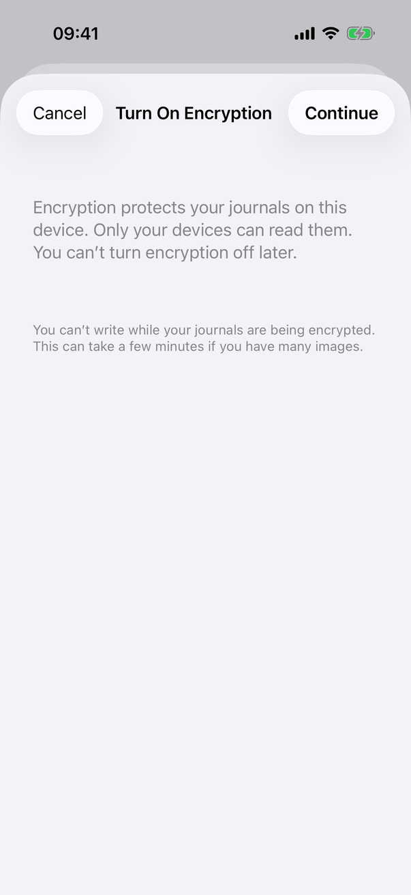
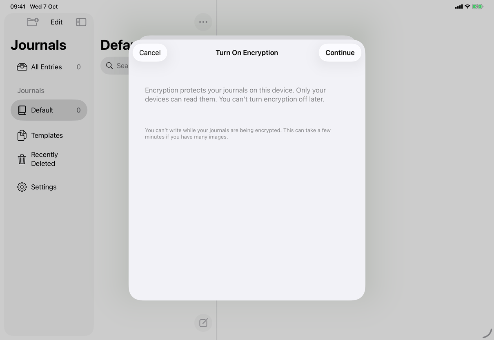

# Turn On Encryption (Apple)

Implements [screens/turn-on-encryption](../../../screens/turn-on-encryption.md). The sequence of work, errors and cancellation rules are on [flows/turn-on-encryption](../flows/turn-on-encryption.md). The views hold the English text as literals; the copy keys named here are the spec's keys for the same text.

## Controls

- **Entry rows.** `EncryptionSettingsSection` (`Views/TurnOnEncryptionView.swift`) is the Encryption section of Settings ▸ Privacy: a `Text` ("Your Journals Are Encrypted" `settings.privacy.encryption.on`, or `settings.privacy.encryption.off`) that carries `.sheet(isPresented: $upgrade.presented, onDismiss:)` with `TurnOnEncryptionView`; then, when encrypted, the Change Password row ([screens/change-password](change-password.md)); else Reconnect… (`common.reconnect`) when `upgrade.offersSignIn`; else Turn On Encryption… (`settings.privacy.encryption.turnOn`), `.disabled(model.locked || (model.replacingVault && !upgrade.pausesWriting))`. Footers: `settings.privacy.encryption.footerOn`, `messages.encryption.turnedOnElsewhere`, or `common.unencryptedWarning`.
- **Sheet.** `TurnOnEncryptionView` is a `NavigationStack(path: $upgrade.path)` whose root is `EncryptionStepView(step: nil)` and whose destinations (`EncryptionUpgrade.Step.password`, `.done`) are the other two steps. `.interactiveDismissDisabled(upgrade.busy || upgrade.unfinished)`. On the Mac `.frame(minWidth: 440, idealWidth: 480, minHeight: 460, idealHeight: 560)`.
- **Each step.** `Form` with `.formStyle(.grouped)`, `.navigationTitle` (empty on the done step), `.navigationBarTitleDisplayMode(.inline)` on iOS, `.navigationBarBackButtonHidden(!canGoBack)` where `canGoBack` is the password step while not busy or unfinished. After the step content come, in this order: a status `Section` (when `showsStatus`), then an error `Section` with a red `.callout` `Text` (no icon) for the step's general error. A `.sheet(isPresented: $addingDevice)` presents `AddDeviceView` from the last step.
- **Step 1, Turn On Encryption.** Intro `Text` in secondary colour with a clear row background (`settings.encryption.intro`, or `settings.encryption.introSynced` when `upgrade.synced`). When synced, a "Your Other Devices" section (`settings.encryption.otherDevices.header`) with three primary-colour `Text` rows (`.update`, `.signIn`, `.agents`). A section with no rows whose footer is `settings.encryption.pauseFooter`. Status while `.checking` and synced: `connectionStatus` (a small `ProgressView` beside secondary text, combined into one element) with `settings.encryption.checking`. Primary button: `common.continue`, or `common.tryAgain` once the step has an error, or `common.reconnect` when `errorOffersSignIn`; Continue and Try Again are `.disabled(upgrade.busy)`.
- **Step 2, Choose a Master Password.** Intro (`settings.encryption.passwordIntro`, or `settings.connect.choosePassword.intro` when synced). When `upgrade.needsCurrentPassword` (recovery format 3, a library with an access password) a section headed `settings.encryption.currentAccessPassword` with a field of that name. Then a section with Master Password (`common.masterPassword`) and Verify (`common.verify`), each followed by its field error, and a `Toggle` `common.showPassword` (`settings.encryption.showPasswords` when the current-password field is also shown). The toggle switches all fields between `SecureField` and `TextField` (local `@State showPassword`). Fields use `.passwordAutofill(creating: true)` (the current-password field uses plain `.password`), `.autocorrectionDisabled()`, `.textInputAutocapitalization(.never)` on iOS, `@FocusState`, and `.errorHint(...)`. A footer-only section shows `settings.password.footer`. Status row while working: `settings.sync.syncing` (`connectionStatus`), `EncryptionProgressRow` (secondary `Text` `settings.encryption.progress` over `ProgressView(value:)`, one accessibility element labelled `settings.encryption.progressLabel` with value `settings.encryption.progressValue` from the rounded percentage), or `settings.encryption.updatingServer`. All fields are disabled while busy or unfinished. Primary: `settings.encryption.turnOn`, `common.tryAgain` after a general error, and `common.tryAgain` (finishing the switch) when unfinished; Turn On is `.disabled(!canTurnOn)`.
- **Step 3, Your Journals Are Encrypted.** A row with clear background: a centred `VStack` with the `lock.shield` symbol at 48 points (`accessibilityHidden(true)`), a `title2` bold `Text` with the `.isHeader` trait (`settings.privacy.encryption.on`) and secondary `Text` `settings.encryption.done.message`. When synced, a section "Your Other Devices" with `settings.encryption.done.otherDevices` and a `Button` `settings.connect.ready.addDevice`, footer `settings.encryption.done.archives`; otherwise only the footer. Toolbar: only `common.done` (`.confirmationAction`, calls `upgrade.done()`); the back button is hidden.
- **Toolbar, steps 1 and 2.** Cancel (`.cancellationAction`, `role: .cancel`, `common.cancel`) is present when not unfinished and `showsCancel`: always on the Mac, only where the back button is not available on iOS (step 1, or step 2 while busy). It is `.disabled(!upgrade.canCancel)`: disabled once the phase is `updatingServer`.
- **Field errors vs general errors.** `EncryptionUpgrade.fieldErrors` (current password wrong or rate limited, passwords differ) appear under the field as red `.callout` text that is `accessibilityHidden(true)`; the same text is the field's accessibility hint through `errorHint`. `EncryptionUpgrade.error` and `errorStep` hold every other error and show in the error section of that step only.
- **Mac notice.** `EncryptionPauseNotice` (`#if os(macOS)`, in `Views/TurnOnEncryptionView.swift`, drawn from `ConnectionPauseNotice` in `Views/SaveFailureNotice.swift`) is a notice bar in the journal window: `messages.writingPaused.encrypting` or `messages.writingPaused.encryptionUnfinished`, and a Show Progress button (`messages.writingPaused.showProgress`) that calls `upgrade.showProgress()`. It lays out as an `HStack` with a `Spacer`, or a leading-aligned `VStack` at accessibility Dynamic Type sizes, on a `.quaternary` background.
- **Presenters.** `showProgress()` on the Mac sets `settingsTab = .privacy`, `settingsPresented = true`, `presented = true`; on iOS it sets `presentedOverApp`, which `EncryptionPresentation` (a `ViewModifier` applied in `JournalApp.swift`) turns into a sheet over the whole window, dropped while locked. An unfinished switch found after a relaunch uses the same two routes. Sign In… from the sheet sets `pendingSignIn`, closes the sheet, and `onDismiss` opens Connect to a Server; a Sign In from a sync message sets `signInRequested`, which `EncryptionPresentation` also turns into a `ConnectionView` sheet.
- **Model.** `EncryptionUpgrade` (`ObservableObject`, one per app, `AppModel.encryption`) holds `path`, `phase`, errors, `unfinished` and the running `Task`; the work is `AppModel.checkEncryptionReadiness`, `turnOnEncryption`, `finishInterruptedEncryption` in `Model/EncryptionOperations.swift`. The views only read it.

## Layout

- **iPhone.** A sheet over Settings (which is itself a sheet) with an inline title and Cancel and Continue as the system's bar-button capsules. Step 2 is pushed with the system back button in Cancel's place and swipe-back.
- **iPad.** The system's regular-width sheet (a centred card about 580 points wide, screenshot) with the same bar; at compact widths the system switches to the iPhone presentation. `.sheet` over the app is also used for the relaunch case.
- **Mac.** A sheet on the Settings window with the frame above. On macOS earlier than 26 sheets show no navigation title, so each step except the last starts with a section holding the title in `.headline` (`if #unavailable(macOS 26)`). Cancel is always present; where the Mac puts a pushed step's back control is not captured and not verified.
- **Dynamic Type.** The `Form` scrolls and wraps; the Mac notice stacks at accessibility sizes. No other switch.

## Commands and shortcuts

| Command | Placement | Shortcut | Enabled when |
| --- | --- | --- | --- |
| `turn-on-encryption` | as in [commands.md](../commands.md) | none | not encrypted, unlocked, not replacing the journals (or pausing for this work) |
| `encryption-continue` | as in commands.md | Return per commands.md; not set in this file | not busy |
| `encryption-turn-on` | as in commands.md | Return in Verify | `canTurnOn`: both new fields filled (and the current password if shown), not busy |
| `encryption-finish` | as in commands.md | none | unfinished, not busy |
| `encryption-cancel` | as in commands.md | Escape in a Mac sheet (system) | not unfinished, phase is not updating the server |
| `sync-reconnect` | as in commands.md | none | the error says encryption was turned on from another device |
| `add-device` | as in commands.md | none | step 3, synced |
| `encryption-done` | as in commands.md | none | step 3 |
| `show-encryption-progress` | as in commands.md | none | Mac only, notice shows |

No `.keyboardShortcut` is set in `Views/TurnOnEncryptionView.swift`; Return and Escape in the sheet are the system's default and cancel actions, which this file does not override and which were not verified at runtime. Focus order on step 2: Current Access Password (if shown), Master Password, Verify; Return in each moves on, Return in Verify turns encryption on when `canTurnOn`.

## Copy differences

- The Mac notice says "this Mac" (`messages.writingPaused.encrypting`, `messages.writingPaused.encryptionUnfinished`); the sheet's own unfinished message says "this device" (`messages.encryption.unfinished`). Both are in the spec.
- Otherwise none; the sheet text is the same on all devices.

## Accessibility

- The progress row is one element (label `settings.encryption.progressLabel`, value `settings.encryption.progressValue`), its children ignored.
- Announcements (`announceForAccessibility`): `messages.encryption.announce.turningOn` when Turn On starts, `messages.encryption.announce.updatingServer` on the transition to updating the server, `messages.encryption.announce.done` after the last step appears, and every general or field error.
- A field error is announced 300 ms after focus has moved to the field, so the announcement is not cut off; the error text is also the field's hint.
- Focus: after Continue, the next step requests focus for Current Access Password or Master Password and takes it 400 ms later, once the push transition has ended. After a field error focus moves to that field.
- The done step's heading carries `.isHeader`; its symbol is hidden.
- Status rows use `.accessibilityElement(children: .combine)`.

## Differences between iPhone, iPad and Mac

- Cancel: always on the Mac, only where Back is not available on iOS, because iOS shows the system back button and swipe-back for a pushed step.
- The notice and Show Progress are Mac only because only the Mac lets the person keep working in the journal window behind a Settings sheet; on iPhone and iPad the sheet covers the window, and `showProgress()` presents the sheet over the app.
- Background time (`UIApplication.beginBackgroundTask`) exists on iOS only; see the flow page.
- The title row for macOS before 26 exists because those sheets have no title bar.

## Screenshots

| Device | State |
| --- | --- |
| iPhone |  Step 1 on a library that is not syncing: Cancel, inline title, Continue; intro and the pause footer. |
| iPad |  The same step in the centred sheet over the library window. |

No Mac capture; the synced step 1, step 2, step 3 and the error and progress states are not captured.

## Source files

- View: `Views/TurnOnEncryptionView.swift` (row, sheet, steps, progress row, presenter, Mac notice), `Views/SaveFailureNotice.swift` (where the Mac notice is drawn), `Views/ConnectionView.swift` (`connectionStatus`, `announceForAccessibility`, `headedField`), `Views/ConnectionSteps.swift` (`errorHint`), `Views/PasswordAutofill.swift`.
- Model: `Model/EncryptionUpgrade.swift` (what the sheet shows and does, error texts, announcements, background time), `Model/EncryptionOperations.swift` (the work and `EncryptionFailure`, `EncryptionPhase`).
- Core: `JournalStore.reencryptedCopy` and `VaultCrypto.makeRecovery` in JournalCore.
- Design: [enable-encryption.md](../../../../docs/design/enable-encryption.md).

## Open questions

See [open-questions.md](../../../open-questions.md).
