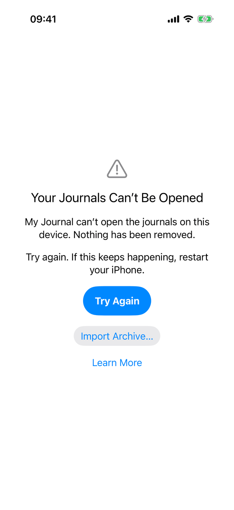
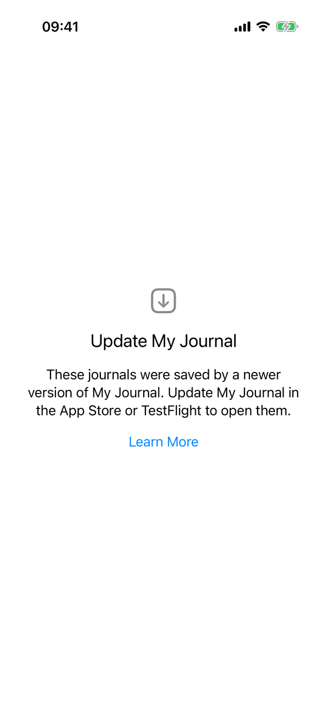
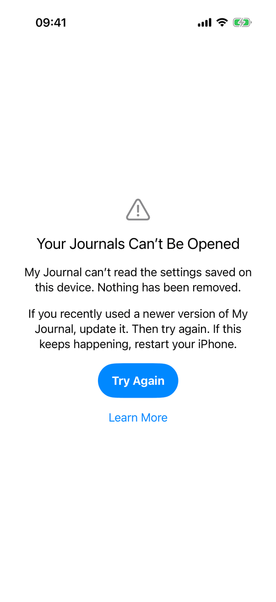
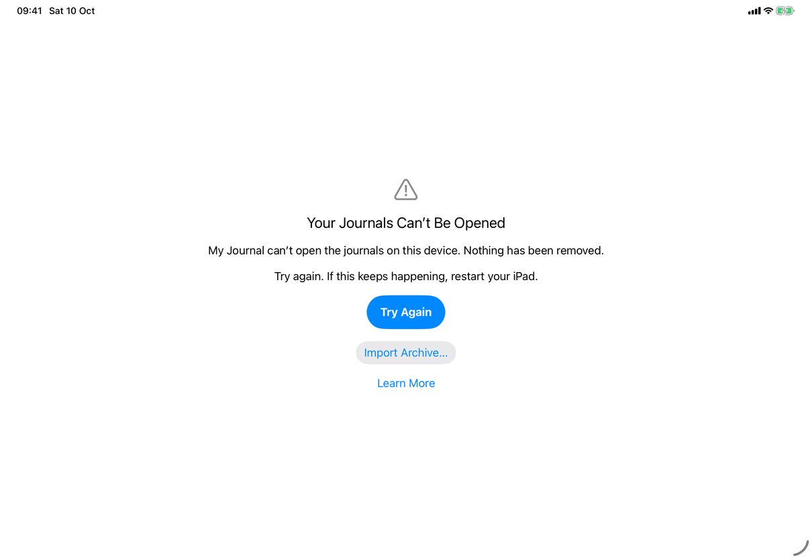
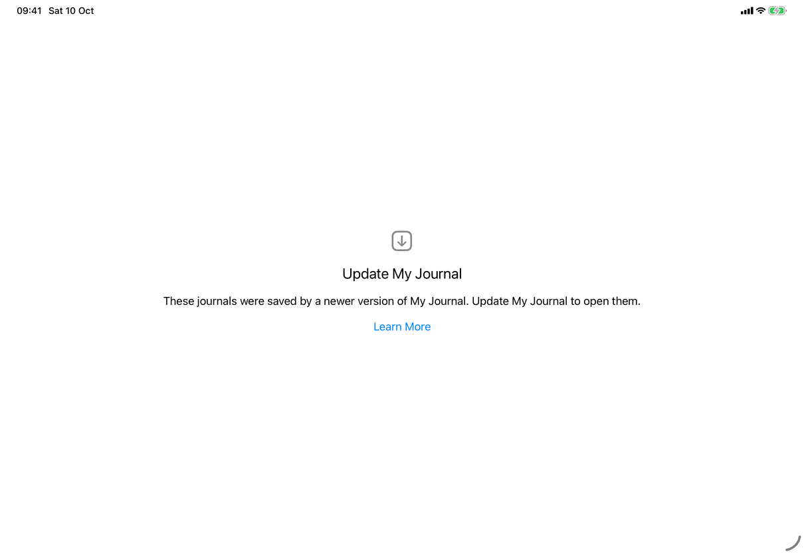
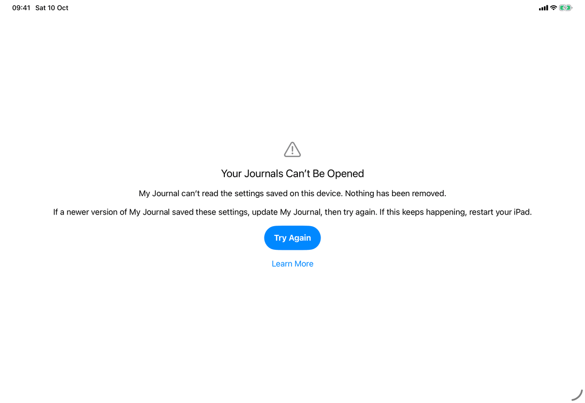
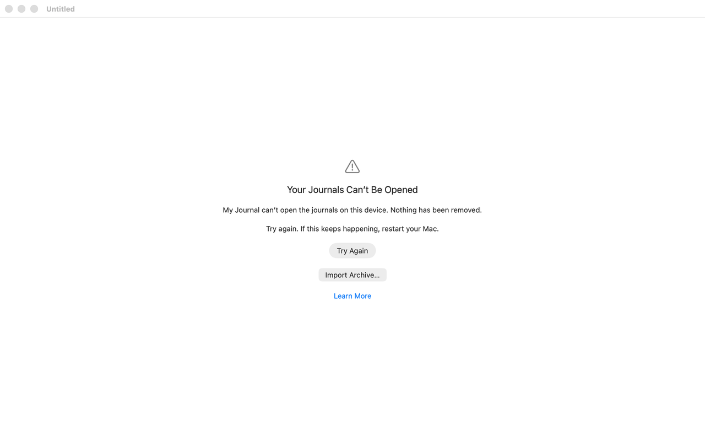
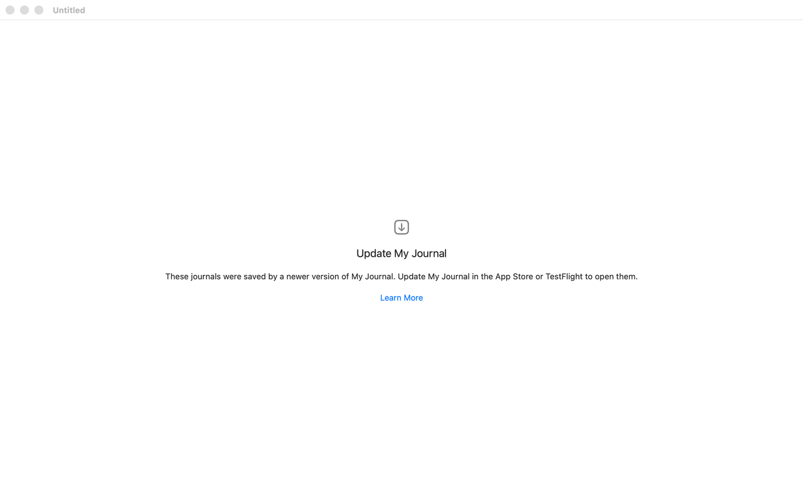

# Unavailable and read-only content (Apple)

Maps [screens/unavailable-content.md](../../../screens/unavailable-content.md). Four separate pieces of UI share the spec page: the library problem screen, the read-only entry, the Unavailable Journals collection and the privacy cover. Since build 18 (`docs/design/build-18-fixes-2026-10-06.md` section 2.1) damaged, unreadable and newer-version libraries have their own screen, `LibraryProblemView`, which the spec now describes with the keys `library.problem.*`; the screenshots are of that screen. Only a missing device key still uses the lock screen. **Draft:** the states that need a later capture run are listed under Screenshots.

## Controls

### Library that cannot be opened

`RootView.window` (the `Group` in `Views/RootView.swift`) picks one view in this order: `ProgressView("Opening Journal…")` until loaded; `UnlockView` when `model.locked`; `LibraryProblemView(problem:)` when `model.showsLibraryProblem`; the welcome screen without a store; in 1.1 the journals with the encryption notice (saved marker or run in progress), then Encrypt Your Journals for an unencrypted library (`Model/EncryptionRouting.swift`, `screens/encrypt-journals`); `RecoveryView`; the journals. A problem state is never locked, so no authentication precedes the screen and it shows nothing of the journals or the server.

Model: `AppModel.libraryProblem` (`Model/LibraryProblem.swift`) with four values. `failOpening` classifies a failure at launch or at the first read of the journals: only a newer version is told apart (`newerVersion`), everything else is `cantOpen`; `settingsUnread` is set by `openSavedLibrary` (`Model/LibraryOpening.swift`) when `configuration.json` exists but does not decode; `needsKey` is set by `lockForMissingDeviceKey`. Failing closes the store, the key and the connection, so a problem state never has a live store. `retryOpening` runs the opening again.

`LibraryProblemView`, in a `GeometryReader` and `ScrollView` with `padding(32)`, centered, `multilineTextAlignment(.center)`, the same layout as the lock and welcome screens:
- Symbol: `exclamationmark.triangle`, or `arrow.down.app` for a newer version; `.largeTitle`, secondary, hidden from accessibility.
- Title (`.title2`, header trait, takes VoiceOver focus on appearing) and one or two paragraphs; the keys per problem are in the spec page and in Copy differences.
- After a failed Try Again, a secondary paragraph saying the journals may still be fine.
- Try Again: `.borderedProminent`, `.controlSize(.large)`, `.keyboardShortcut(.defaultAction)`; for `cantOpen` and `settingsUnread` only. While it runs, the buttons give way to `ProgressView("Opening Journal…")` and the text stays. When it ends in a problem again, the line "Still can't be opened." appears under it (also announced) and VoiceOver focus returns to the button.
- Import Archive…: `.bordered`, for `cantOpen` only; sets `model.archiveImportRequested`, which the window's `.fileImporter` answers (command `import-archive`). It is hidden on iPhone and iPad while protected data is unavailable.
- Erase Journals and Settings…: `UnopenedEraseButton` (plain red Button, `role: .destructive`; asks for the device's authentication when App Lock is on or unknown, then an `.alert` with Erase and Cancel). Offered only after one failed Try Again (`failedRetries > 0`), when protected data is available, and not for a newer version.
- Learn More: plain Button in the tint colour, opens the troubleshooting guide (`AboutLink.cantOpenGuide`) with `openURL`; accessibility hint says it opens a browser. It is the only button for a newer version, and on the Mac takes Return there (`.keyboardShortcut(.defaultAction)` for that case only).

On iPhone and iPad, `AppModel` listens for the protected-data notifications: a launch before the first unlock fails to open for a reason that ends by itself, so `protectedDataBecameAvailable` runs `retryOpening(tapped: false)`; that attempt never counts toward Erase.

Settings in a problem state: `SettingsView` shows only secondary text that settings are available once the journals open (Settings window on the Mac, sheet on iPhone and iPad). `closePresentations()` closes every sheet when a problem appears.

**Missing device key (`needsKey`)** is the lock screen, `UnlockView`: `needsCredential` is true when `model.masterKey == nil`, so the credential `SecureField` and Unlock Button show with the model's error note in red (`messages.library.deviceKeyUnavailable`); under it a group (accessibility label is its caption) with Import Archive… and the Erase button, for a person who no longer has the credential. Entering the credential unlocks and saves the key to the keychain again. A wrong credential shows `messages.error.invalidRecoveryKey`. `messages.library.cannotOpen` is now only the guard text of `storeForUnlock` (`AppLockOperations.swift`), reached when unlocking finds no store; a problem state is never locked, so it is rare. `messages.error.newerVersion` is no longer shown at launch.

### Content from a newer version

`JournalDocument.isEditable` (JournalCore `Models.swift`; `requiresMarkdownSource` is in `MarkdownDocument.swift`) and `JournalLifecycleSnapshot.location(of:)` decide. Views:
- **Read-only entry or template:** `AppModel.canEdit` is false, so `NativeEditor` gets `editable: false` (selection and copy still work). `EntryEditingNote` (a secondary `Text` under the title) shows `messages.error.unsupportedFormat`, or `messages.unavailable.markdownSource` for Markdown that can only be shown as source. On iPhone and iPad the title is a selectable `Text` with accessibility label "Title" and the title as the value (in `EntryHeaderView`); on the Mac the title field is disabled. `offersDelete` and `canPin` are false, so no swipe offers Delete or Pin and the menu leaves out Change Date, Move Entry, Save as Template and Delete Entry.
- **View Preview dimmed:** iOS `sourceModeButton` is `.disabled` with `.iconHelp(...)` (`common.previewUnavailable`); the Mac toolbar button is dimmed with the same help tag (`JournalToolbarController`, `previewUnavailable`). Command `view-source`.
- **Journal from a newer version:** `liveJournals` only includes editable journals, so it is absent from the Journals list; its entries are `unavailable(.unsupported)`. A deleted one shows in Recently Deleted without Restore: `DeletedJournalView` shows `messages.unavailable.restoreJournalNeedsUpdate` and `ArchiveExportControls` (Export Archive…, command `export-archive`).
- **Pins and journal order:** `AppModel.libraryFooter` supplies `messages.library.needsUpdate` as the Settings ▸ Sync footer while connected; a failed pin, unpin or journal move shows `messages.generic.pinFailed`, `messages.generic.unpinFailed` or `messages.generic.moveJournalFailed` in the generic alert, or `messages.library.needsUpdate` when the failure is `LibraryError.newerVersion` (`AppModel.libraryFailure`).
- **Conflict version:** `ConflictReview` shows a `DeletionSheet` titled "Review Changes" with `messages.conflict.updateToReview` and `ArchiveExportControls` for an entry or template. A journal or permanent-deletion row that this version can't read stays held in the store (`JournalStore.heldConflictIDs()`): the journal is located as unsupported, and Settings ▸ Sync adds the footer line `messages.conflict.kept.updateNeeded`.
- **Sync, import, merge, other operations:** `messages.sync.appUpdateNeeded` (Settings ▸ Sync footer and Sync Status), `messages.import.archiveNeedsUpdate`, `messages.import.mergeNeedsUpdate`, `messages.lifecycle.unsupportedJournal`, `messages.generic.journalDeleteNeedsUpdate`, `messages.generic.deleteNeedsUpdate`: each is shown in the sheet or alert of its operation; see [messages.md](../messages.md).

### Unavailable Journals

- **Sidebar row:** `JournalSidebarView` adds a row in the section after Templates and Recently Deleted, label `common.unavailableJournals`, symbol `exclamationmark.folder`, only `if model.showingUnavailable || hasUnavailableEntries`. On iPhone it is a row of the Journals screen; on iPad and Mac a sidebar row. Choosing it is `choose-collection`.
- **List:** the entries list with `model.showingUnavailable` (`.unavailable` destination): title `common.unavailableJournals` (`collectionTitle`), search prompt `common.searchUnavailableEntries` (`searchPrompt`), empty text `messages.unavailable.empty` (`emptyListState`, without a New Entry button), no Pinned section (`showsPinnedSection`). Mac subtitle: the entry count. Entries listed are those whose `location(of:)` is `.unavailable` (journal missing, or from a newer version, which includes a journal whose change from another device is held).
- **Opening an entry:** read-only, with `EntryRecoveryNotice` above the title (iOS: in the editor header; Mac: a band above the title), same placement as in [recently-deleted](recently-deleted.md). Text and Buttons by reason: `common.updateToRestoreEntry` (none); `common.journalNotArrived` with `common.trySyncingAgain` (`AppModel.sync(retryingRefused: true)`) when `model.connection` exists; `common.journalUnavailableEntrySaved` when it does not; `library.recentlyDeleted.restoreTo` (command `restore`) is added for a missing journal when the entry itself is deleted (its own deletion, a legacy marker, or saved next to a permanent deletion): it puts the entry in the Default Journal at once; `library.recoveryNotice.createJournalFirst` replaces it when no journal is in use.
- **Rows:** no swipe actions and no Delete Entry (`offersDelete` needs a journal in use); the context menu keeps Version History… and Image Descriptions….
- **Recovery:** when the journal arrives or the app is updated, `JournalNavigation` sets `showingUnavailable = false` and follows the open entry into its journal.

### Privacy cover

- `LockedCover` (`Model/PrivacyCover.swift`): a `Rectangle().fill(.background)` ignoring safe areas, with `Label("…", systemImage: "lock")` (`common.myJournalIsLocked`, secondary) only while `model.locked`; blank otherwise.
- `JournalApp.swift` adds it as an `.overlay` on `RootView` in the `WindowGroup` on every device, when `scenePhase != .active && model.appLockOn && !model.unlockState.requestInFront`.
- iPhone and iPad additionally: `PrivacyCover` creates one `UIWindow` per connected scene at `windowLevel = .alert + 1` hosting `LockedCover`, on `UIScene.willDeactivateNotification` (not while App Lock's own authentication request is in front) and `didEnterBackgroundNotification`, and hides them on `didActivateNotification`. That is what hides sheets, popovers and alerts in the app switcher.
- Mac: only the overlay on the journal window's content. The Settings window is a separate `Settings` scene with no overlay in the source (not verified at runtime; A41).

## Layout

- **iPhone, iPad:** the problem screen replaces the whole window content (the split view or the stack), centered, scrolling when text is large. iPad shows the same screen wider; the paragraphs are not width-limited beyond the window's padding. The Unavailable Journals list is a page of the stacked navigation on iPhone and the list column on iPad.
- **Mac:** the problem screen fills the journal window. The title bar reads "Untitled" in the screenshots because the screen sets no title. The list is the middle column.
- **Dynamic Type:** `ScrollView` with a `minHeight` of the window keeps the content centered and scrollable; texts and button labels use `fixedSize(horizontal: false, vertical: true)` so they wrap. At accessibility sizes the iPad uses stacked navigation for the Unavailable list (`usesStackedNavigation`).

## Commands and shortcuts

| Command | Placement | Shortcut | Enabled when |
| --- | --- | --- | --- |
| `import-archive` | Problem screen button (cantOpen); lock screen of a missing key; File menu on the Mac | none on the buttons; File ▸ Import Archive… | `AppModel.canImportArchive`: with a problem, only cantOpen and needsKey, and not while retrying |
| `erase-unopened` | Problem screen and missing-key lock screen (`UnopenedEraseButton`) | none | After one failed Try Again (problem screen), protected data available; at once on the lock screen |
| `retry-opening` | Try Again on the problem screen | Return (default action) | Not for a newer version; not while retrying |
| `open-library-guide` | Learn More on the problem screen | Return on the Mac for a newer version | Always |
| `unlock-with-credential`, `use-credential`, `unlock-with-device` | Missing-key lock screen | Return in the credential field (`onSubmit`); the device-unlock Button has `.defaultAction` | As in [commands.md](../commands.md) |
| `restore` | Recovery notice (Restore to “{name}”) | none | As in [commands.md](../commands.md) |
| `try-syncing-again` | Recovery notice | none | Journal missing and the library syncs |
| `export-archive` | Export Archive… in a deleted newer-version journal and in the unsupported review | none | As in [commands.md](../commands.md) |
| `choose-collection` | The Unavailable Journals row | arrow keys in the focused Mac sidebar | Not in journal edit mode |
| `view-source` | Reading bar and Mac toolbar | ⌥⌘U (View menu) | View Preview dimmed for an entry that cannot be previewed |

Keyboard: Return runs Try Again (the default action), or Learn More on the Mac for a newer version.

## Copy differences

The text is the spec's. Where it is written in code:
- Problem screen titles `library.problem.title` and `library.problem.updateTitle`; paragraphs `library.problem.cantOpen.message` and `.advice`, `library.problem.settingsUnread.message` and `.advice`, `library.problem.newerVersion.message`. `{device}` is `DeviceUnlockMethod.deviceName`: iPhone, iPad or Mac. The strings are literals in `LibraryProblemView`.
- After a failed Try Again: `library.problem.mayBeFine` and `library.problem.stillClosed`; buttons `common.tryAgain`, `common.importArchive`, `settings.erase.button`, `library.problem.learnMore`.
- Settings, in a problem state: `settings.libraryProblem`. Missing-key lock screen: `library.problem.missingKey.caption` with the credential's name (such as Master Password).
- The erase warning is `settings.erase.alert.unopened` (built in `EraseSection.message` from `.reasonCantOpen` or `.reasonNeedsKey`, and `.serverKnown` or `.serverUnknown`).
- `messages.error.newerVersion` and `messages.library.cannotOpen` are no longer shown on the lock screen at launch; the first is replaced by the screen above.
- The Learn More button in the code opens the troubleshooting guide in the project's repository on the web (`AboutLink.cantOpenGuide`).

## Accessibility

- Problem screen: VoiceOver is sent to the title (`@AccessibilityFocusState`) and on iOS gets a screen-changed notification once per problem; the title has the header trait; the symbol is hidden. The "Still can't be opened." line is announced when it appears and VoiceOver focus returns to Try Again. Learn More has the hint that it opens the guide in the browser. On the missing-key lock screen the Import and Erase group is one container labelled with its caption.
- Read-only entry: the note is plain text read in order before the title; the iOS title reads as "Title" with the text as value. On the Mac the disabled title field is dimmed.
- Recovery notice: plain `Text` and standard Buttons (full-width tap area), reachable with Full Keyboard Access; no extra labels.
- Privacy cover: the lock label is the only element while locked; a blank cover has none.
- Accessibility text sizes: the problem screen scrolls; the notice on the Mac is limited to half the detail height and scrolls.
- Reduce Transparency and Increase Contrast: the cover is an opaque system background colour; no materials are used on these screens.

## Differences between iPhone, iPad and Mac

- The privacy cover is two layers on iOS (the overlay and system-level windows above sheets and alerts) and one on the Mac (the overlay), because iOS shows the app switcher snapshot of every window, whereas the Mac window's own content is covered.
- Import Archive… and Erase are held back on iPhone and iPad while protected data is unavailable: a launch before the first unlock can fail for a reason that ends by itself. The Mac has no equivalent, so Try Again is its retry.
- The troubleshooting text names the device (iPhone, iPad, Mac), so the advice to restart is correct on each.
- The recovery notice scrolls with the entry on iOS and is a fixed band on the Mac.
- The Settings window on the Mac and the Settings sheet on iOS both show the same short text in a problem state.

## Screenshots

| Device | Screenshot | State |
| --- | --- | --- |
| iPhone |  | Triangle, title, two paragraphs, Try Again (prominent), Import Archive… (bordered), Learn More; no Erase because no retry has failed |
| iPhone |  | Down-arrow symbol, "Update My Journal", one paragraph, Learn More only |
| iPhone |  | Same title as cantOpen with the settings paragraphs; Try Again and Learn More, no Import |
| iPad |  | The same screen centered in the full window; "restart your iPad" |
| iPad |  | The newer-version screen, paragraph on one line |
| iPad |  | The settings-unreadable screen |
| Mac |  | The journal window with the title bar "Untitled" and "restart your Mac"; Try Again, Import Archive… and Learn More (the window is not in front, so the prominent button is drawn grey) |
| Mac |  | Newer-version screen; Learn More is the default button |
| Mac |  | Settings-unreadable screen |

The read-only entry, the Unavailable Journals list and the privacy cover have no screenshots: the capture set holds only the library problem screens for this page (the recovery notice is shown on [recently-deleted](recently-deleted.md)).

**Screenshots pending** (a capture run is needed; none made by hand): unavailable-content-library-cant-open-retried (cantOpen after one failed Try Again: "Still can't be opened.", the secondary paragraph, the red Erase Journals and Settings… button), unavailable-content-erase-unopened-alert (the erase warning for journals that can't be opened, per device), unavailable-content-import-note (the Import Archive sheet with the extra sentence) and unavailable-content-settings-problem (Settings with the one line of text). The missing-key lock screen is already in the lock-screen captures (master-password, wrong-password). Until then the page is `draft`.

## Source files

View:
- `Views/LibraryProblemView.swift`: the problem screen and its actions.
- `Views/UnopenedEraseButton.swift`: Erase without reading anything.
- `Views/UnlockView.swift`: the lock screen, including the missing-key form.
- `Views/RootView.swift`: which view the window shows; entries list, empty states, detail.
- `Views/EntryEditingNote.swift`, `Views/EntryRecoveryNotice.swift`, `Views/EntryHeaderView.swift`, `Views/DeletedJournalView.swift`: notes and notices.
- `Views/JournalSidebarView.swift`: the Unavailable Journals row.
- `JournalApp.swift`: the cover overlay.

Model: `Model/LibraryProblem.swift` (problems, retry, protected data), `Model/LibraryOpening.swift` (launch opening and the configuration read), `Model/AppModel.swift` (first read, `unlockWithRecovery`), `Model/AppLockOperations.swift` (unlock guards), `Model/JournalNavigation.swift` (collections, `canEdit`), `Model/PrivacyCover.swift` (`LockedCover`, iOS cover windows).

Core: `JournalLifecycle.swift` (`EntryLocation`, `UnavailableJournal`), `Models.swift` (`isEditable`), `MarkdownDocument.swift` (`requiresMarkdownSource`).

Design records: `docs/design/build-18-fixes-2026-10-06.md` (section 2.1), `docs/design/missing-device-key-unlock.md`, `docs/design/journal-lifecycle-ui.md`, `docs/design/pre-release-fixes-2026-09-27.md`.

## Open questions

See [open-questions.md](../../../open-questions.md): A4 to A6 (launch failures on the lock screen, the dead-end Unlock button, an unreadable settings file looking like a first launch) are resolved in build 18 by the screen above, which the spec now describes; B35 (the missing-key text names the recovery key); A41 (on the Mac the privacy cover covers only the journal window). D56 records that Windows has no mapping of the problem screen yet.
