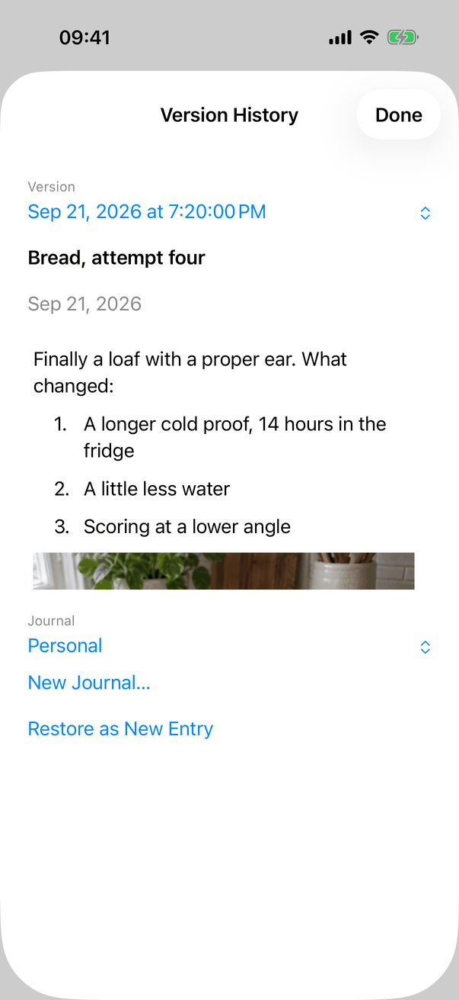
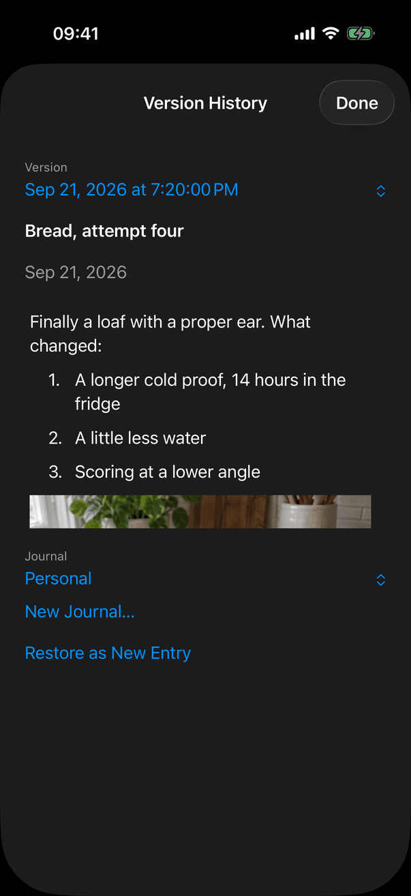
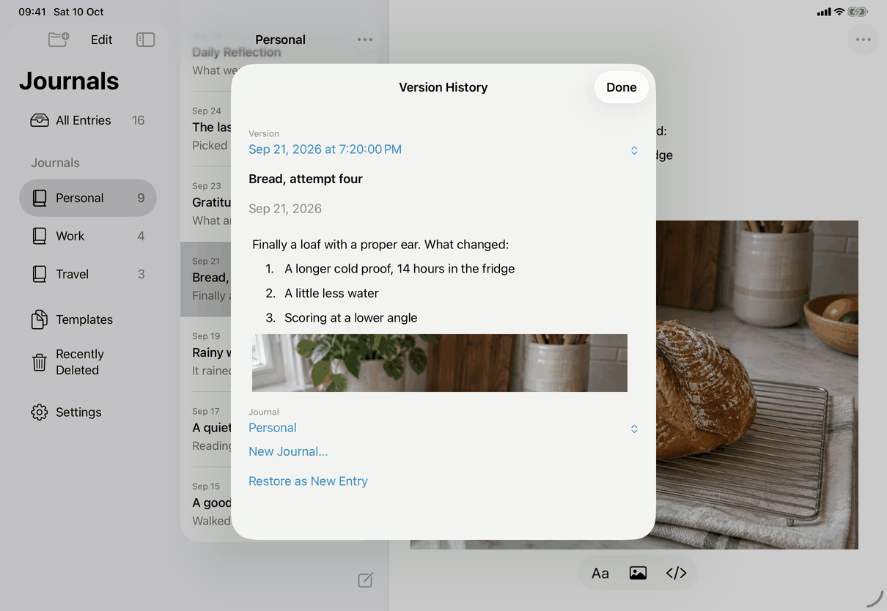
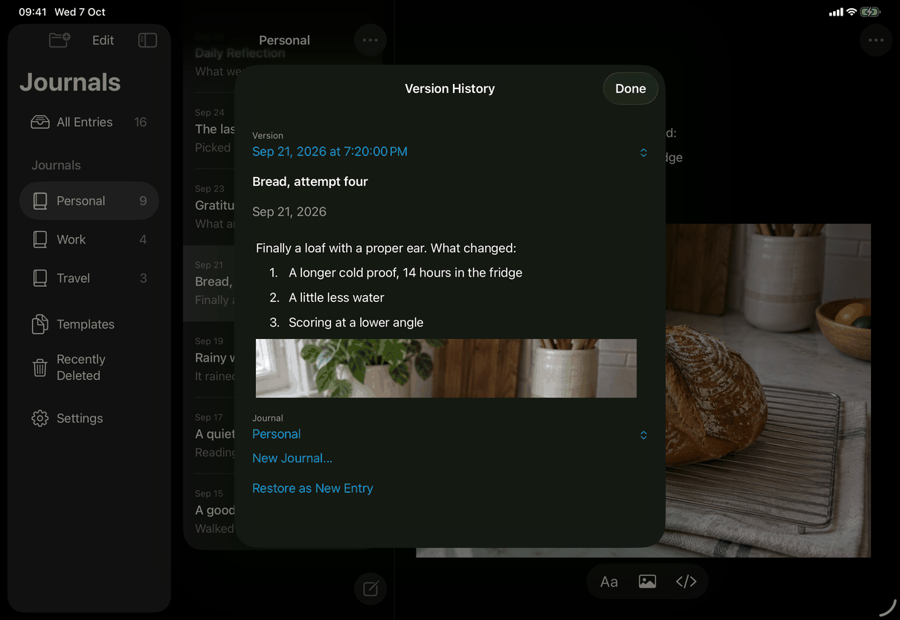
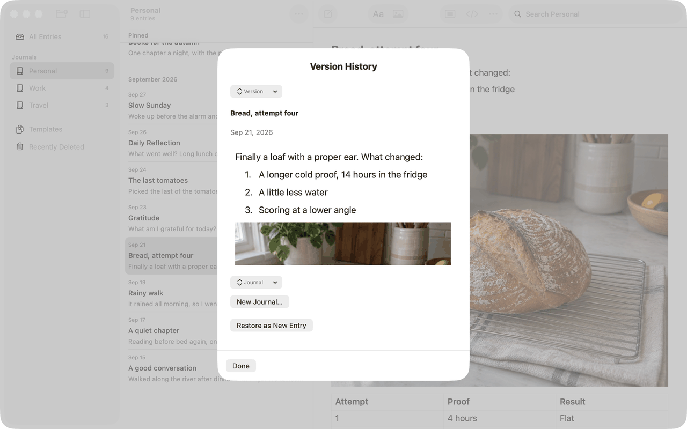

# Version History (Apple)

How the Apple apps implement the spec's [version-history](../../../screens/version-history.md) for entries and templates: the sheet `VersionHistoryView`. Sheet conventions are in [platform.md](../platform.md), section 9. The journal's own history is a different sheet.

## Controls

`RootView` presents `.sheet(item: $history) { VersionHistoryView(sourceID:sourceKind:) }`. The entry point is the "Version History…" action (`common.versionHistoryEllipsis`, symbol `clock.arrow.circlepath`) of `RootView.entryActionCatalog`, shared by the Entry Actions menu and the row context menu; it is present for entries, templates and items in Recently Deleted, and `performRowAction` first selects the item. `sourceKind` is "entry" or "template" and decides which controls show.

| Spec element | Apple control | Notes |
| --- | --- | --- |
| Title `editor.history.title`, Done `common.done` | iPhone, iPad: `NavigationStack` with an inline title and `ToolbarItem(.confirmationAction)`. Mac: `Text` in `.title2.bold()`, a `Divider`, then an `HStack` with Done at the leading end | `Button("Done")` has `.keyboardShortcut(.cancelAction)` (Escape on the Mac and with a hardware keyboard) and is disabled while restoring. `.interactiveDismissDisabled(busy)` blocks swipe-down on iOS while restoring. |
| Loading | `ProgressView("Loading History…")` (`editor.history.loading`) | Shown until `store.history(for:)` returns. |
| No versions | `Text`, `.secondary` (`editor.history.empty`) | Only when there is no error text. |
| Version picker | `HistoryVersionPicker`: a `Menu` whose content is an inline `Picker("Version")`, with a `WrappingMenuLabel` as its label (caption `common.version` in `.caption`, `.secondary`, above the value, with a `chevron.up.chevron.down`) | Titles are `HistoryVersions.titles`: the version's modification time as `.abbreviated` date and `.standard` time (seconds); equal times get " · 1", " · 2" (`editor.history.versionDuplicate`). Order from `HistoryVersions.newestFirst`. Fallback value `editor.history.chooseVersion`. The label is one accessibility element with the caption as label and the value as value. |
| Preview | `Text` headline (`displayTitle`), for entries a `Text` date (`.dateTime.year().month().day()`, `.secondary`), then a read-only `NativeEditor` (`editable: false`, `.constant(document)`, its own `EditorActions`) with `.frame(minHeight: 220)` | The same text view as the entry editor, so the preview has the editor's blocks and images; images load with `store.attachment` per version. The text size is `@ScaledMetric(relativeTo: .body)` 17, on the Mac too (it does not follow View ▸ Zoom). The editor scrolls inside the sheet's own scroll view. A version in a newer format shows `editor.history.updateToRestore` and `ArchiveExportControls` instead. |
| Journal picker (entries) | The same `Menu` with an inline `Picker("Journal")` and `WrappingMenuLabel` (caption `editor.history.journalLabel`), choices "Choose a Journal" (`common.chooseJournal`) and every journal | Duplicate names get date, time and ordinal (`editor.history.journalDuplicate`); an empty name is `common.untitledJournal`. Initial value is the entry's own journal when it is in use. |
| New Journal… | `Button` (`common.newJournalEllipsis`), disabled while busy or `replacingVault` | Opens `RecoveryJournalView` in a nested `.sheet` and clears the chosen journal (the spec's [destination-journal](../../../screens/destination-journal.md)). With no journals: `Text` `editor.history.createJournalFirst` above it. |
| Restore button | Plain `Button` titled `editor.history.restoreAsNewEntry` or `editor.history.restoreAsNewTemplate` | Disabled by `canRestore` (version readable, destination valid for entries, not loading, busy, restored, unlocked, not replacing the library). Hidden after a restore. |
| Error text | `Text`, `.secondary`, `.textSelection(.enabled)` | |
| Restored but not shown | `Text` `editor.history.restored` or `editor.history.restoredTemplate` | When `restoreHistoricalVersion` returns false (the list could not refresh); the sheet stays. |
| Recovery buttons | `Button`s Reload History (`editor.history.reload`) and Reload Journals (`common.reloadJournals`) | Reload History reads the versions again; Reload Journals refreshes the journals, then asks to choose one. |
| Progress | `ProgressView` "Loading Journals…" (`editor.history.loadingJournals`) or "Restoring Version…" (`editor.history.restoring`) | |

Model: `AppModel.restoreHistoricalVersion` (`HistoryOperations.swift`) first calls `finishPendingSave()`; if that fails it throws the text of `messages.save.before.goBack`. It then calls the store's `restoreHistoryCopy`, and `commitHistoricalCopy` selects the new copy: it leaves Recently Deleted, Unavailable and the search, switches to Templates for a template or to the copy's journal, and selects it, so the sheet closes onto the new item. Core: `HistoryRecovery.swift`.

States are the spec's table: loading and empty as above; load failed and version gone use `error` plus Reload History (`needsReload`); journal gone sets `error` to `messages.history.chooseJournal` when `model.journals` loses the chosen id (also while the sheet is open, via `onValueChange(of: destinationIDs)`); a chosen journal that a newer version saved sets `messages.lifecycle.unsupportedJournal`. Locking cancels the task, clears versions, images and the destination, closes nested sheets and dismisses.

## Layout

- iPhone: full-height sheet, inline title, Done trailing; one scrolling column (24 pt padding, 20 pt spacing): picker, title, date, the 220 pt preview, journal picker, New Journal…, Restore.
- iPad: a centred form sheet with the same bar and column; the preview is wider but keeps the minimum height.
- Mac: `frame(minWidth: 360, idealWidth: 600, minHeight: 420, idealHeight: 620)`; title and button row fixed, the middle scrolls. The capture shows the sheet narrower than the ideal width.
- Dynamic Type: the picker labels wrap (`fixedSize` vertically, leading aligned), so long dates and journal names are never truncated; the preview editor uses the scaled body size.

## Commands and shortcuts

| Command | Placement | Shortcut | Enabled when |
| --- | --- | --- | --- |
| `entry-version-history` | As in [commands.md](../commands.md): Entry Actions and the row context menu | None | Always offered for the open or selected item (not for a journal); each press first selects the entry |

In the sheet: Escape or Done closes (disabled while restoring). There are no other shortcuts; Return does not press Restore. Focus follows the system order: version picker, journal picker, New Journal…, Restore.

## Copy differences

None: no `mac` variant applies. The Mac shows the pickers differently (see Differences) but with the same words.

## Accessibility

- `WrappingMenuLabel` is one element: label the caption ("Version" or "Journal"), value the chosen title, for example "Version" with the value "Sep 21, 2026 at 7:20:00 PM". Their accessibility identifiers (for UI tests) are "history-version" and "history-destination".
- Errors are announced as they appear (`JournalAccessibility.announce`), except while locked.
- The preview is the entry editor in read-only mode, so its text, lists, pictures and their descriptions are reachable by VoiceOver as in the editor ([entry-editor](entry-editor.md)).
- At the largest text sizes nothing is clipped: values wrap and the sheet scrolls.

## Differences between iPhone, iPad and Mac

- Done in the navigation bar (iPhone, iPad) against a bottom button row (Mac): a `confirmationAction` is placed in the bar by iOS; the Mac sheet has no bar.
- Version and Journal pickers: on iPhone and iPad the closed control shows the caption above the chosen value, as the spec says. On the Mac the `Menu` becomes a pop-up button that shows only the caption ("Version", "Journal") with up-down arrows; the chosen version or journal is not visible until the menu opens (A40). The cause is not established (the label's accessibility label appears to become the pop-up button's title); it contradicts the spec.
- Swipe-down protection while restoring: iOS only.
- The preview is a nested scroll view on every device (the sheet scrolls and the read-only editor scrolls inside it), so a long version needs a second scroll in the 220 pt preview.

## Screenshots

| Device | State |
| --- | --- |
| iPhone |  Version "Sep 21, 2026 at 7:20:00 PM", the title "Bread, attempt four", its date, the first lines of the preview (the picture is cut off at the preview's height), Journal "Personal", New Journal…, Restore as New Entry. |
| iPhone |  The same in dark appearance; all colours are system colours. |
| iPad |  Centred form sheet over the split view; the same content, wider. |
| iPad |  Dark appearance. |
| Mac |  Sheet with the title, pop-up buttons that show only "Version" and "Journal", the preview, New Journal… and Restore as New Entry as bordered buttons, and Done at the bottom left. |

## Source files

View:
- `apps/apple/JournalApp/Views/VersionHistoryView.swift`: the sheet and its states.
- `apps/apple/JournalApp/Views/HistoryMenu.swift`: `WrappingMenuLabel`, `HistoryVersionPicker`, `HistoryVersions` (order and titles).
- `apps/apple/JournalApp/Views/RecoveryJournalView.swift`: the New Journal… sheet.
- `apps/apple/JournalApp/Views/RootView.swift`: the sheet presentation and the action catalog.
- `apps/apple/JournalApp/Editor/NativeEditor.swift`: the read-only preview.

Model:
- `apps/apple/JournalApp/Model/HistoryOperations.swift`: restore, and selecting the copy.

Core:
- `apps/apple/Packages/JournalCore/Sources/JournalCore/HistoryRecovery.swift`: reading history and making the copy; the wire rules are in `protocol/history-recovery.md`.

Design records: `docs/design/history-recovery.md`, `docs/design/version-checkpoints.md`.

## Open questions

See [open-questions.md](../../../open-questions.md), A40 (the Mac pop-up buttons show only the caption, not the chosen value).
