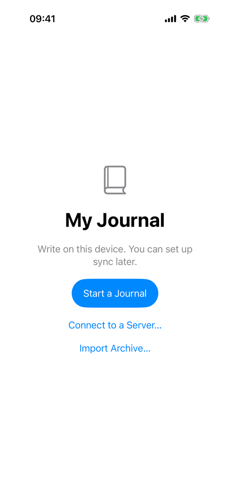
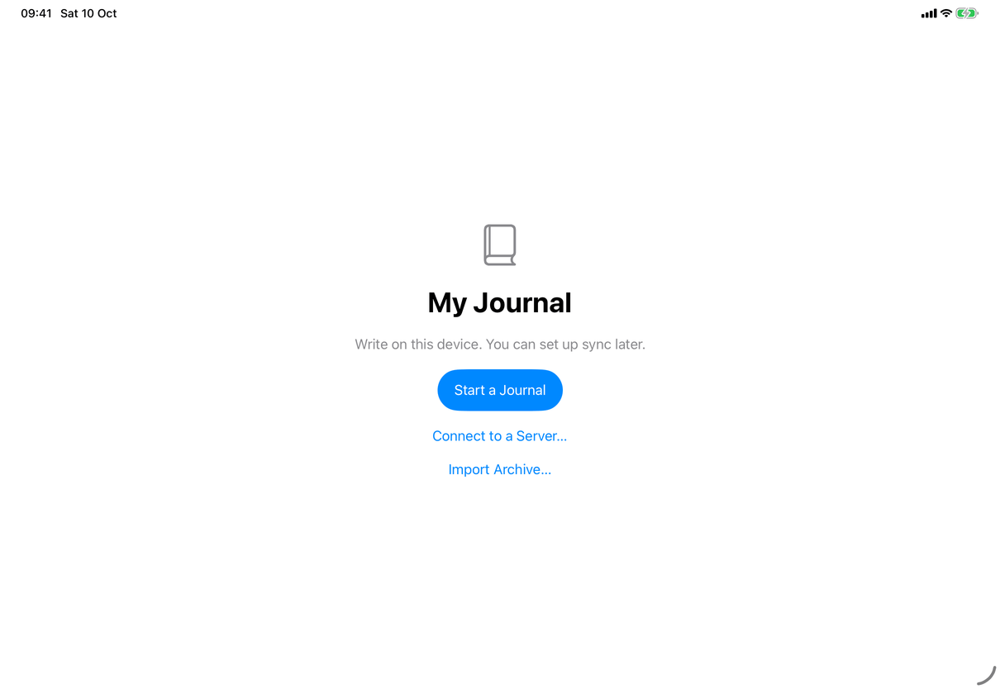
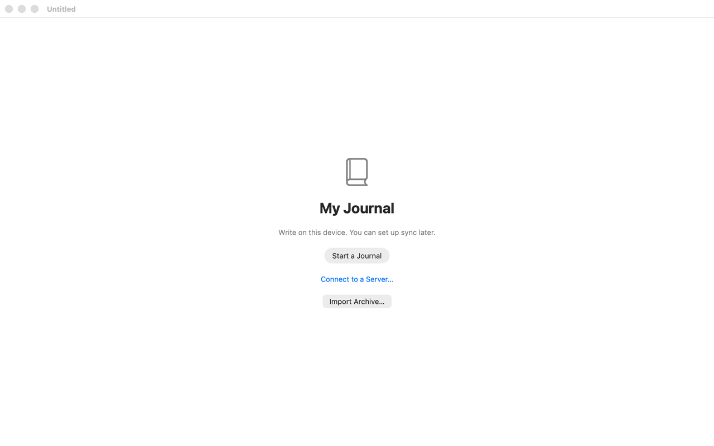

# Welcome (Apple)

Implements [screens/welcome](../../../screens/welcome.md). The Start a Journal sheet is [flows/create-library](../flows/create-library.md). The view holds the English text as literals; the copy keys named here are the spec's keys for the same text.

## Controls

- **Where it lives.** The `welcome` computed property of `RootView` (`Views/RootView.swift`), chosen by `RootView.window` when `model.store == nil`. The precedence in code is: `ProgressView("Opening Journal…")` (`library.app.loading`) while `!model.loaded`; `UnlockView` when `model.locked`; the library problem screen (`LibraryProblemView`) when `model.showsLibraryProblem`; this screen when there is no store; `RecoveryView` when a recovery key waits; otherwise the main navigation. A configuration read happens in `AppModel.load()` (`Model/LibraryOpening.swift`).
- **Container.** `GeometryReader` around a `ScrollView` holding a `VStack(spacing: 20)` with `.padding(40)`, `.frame(maxWidth: .infinity)` and `.frame(minHeight: geometry.size.height)`, which centres the column and lets it scroll at large text sizes.
- **Symbol.** `Image(systemName: "book.closed")` at 48 points, light weight, secondary colour, `accessibilityHidden(true)`.
- **Title and message.** `Text` in `.largeTitle.bold()` (`library.welcome.title`); secondary `Text`, centred (`library.welcome.message`). The title has no heading trait set in this file.
- **Start a Journal.** `Button` (`library.welcome.start`) with `.buttonStyle(.borderedProminent)` and `.controlSize(.large)`; sets `creatingLibrary`, which `RootView` presents as `.sheet(isPresented: $creatingLibrary) { CreateJournalView() }`.
- **Connect to a Server….** `Button` (`common.connectToServer`) with `.buttonStyle(.plain)` and `.foregroundStyle(.tint)`, so it reads as a link on every device; sets `connect`, presented as `.sheet(isPresented: $connect) { ConnectionView() }`.
- **Import Archive….** `Button` (`common.importArchive`) with the default style. It sets `model.archiveImportRequested`; it does not own a file importer, because the window already has one and iOS presents only one per view hierarchy (source comment). `RootView` has `.fileImporter(isPresented: $model.archiveImportRequested, allowedContentTypes: [.journalArchive])`; a chosen file becomes `archiveToImport`, which presents `ArchiveImportView` (skipped when the app locked meanwhile or the library is being replaced). An archive file opened from outside arrives through `.onOpenURL` (extension `journalarchive`, case-insensitive) and is held in `pendingArchive` until the window is ready.
- **States.** Loading is the progress view above. The error state is the window's general alert: `.alert("My Journal", ...)` (`common.alertTitle`) with the error text, an OK button (`common.ok`, `role: .cancel`) and Try Again only for a save failure; it is suppressed while `creatingLibrary` is true, because the create sheet shows its own error. The code's alert title is "My Journal" while the catalog's `common.alertTitle` reads "Journal".
- **Model.** `AppModel` (`@EnvironmentObject`): `loaded`, `store`, `locked`, `archiveImportRequested`, `error`. Nothing is created until a button is used.

## Layout

- **iPhone.** One centred column in the full screen, no navigation bar (see the screenshot).
- **iPad.** The same column, centred in the full window; no sidebar is shown until a library exists, so the split view of the library window is not involved here.
- **Mac.** The column fills the journal window (default 1100 x 720, minimum 801 x 420 points, from `JournalApp.swift`). The window has no toolbar on this screen. In the capture the title bar reads "Untitled" and the window is inactive, so the prominent button is grey rather than accent colour.
- **Dynamic Type.** The column scrolls and wraps; nothing switches layout.

## Commands and shortcuts

| Command | Placement | Shortcut | Enabled when |
| --- | --- | --- | --- |
| `connect-to-server` | as in [commands.md](../commands.md) | none | the button is always enabled on this screen |
| `import-archive` | as in commands.md; the File ▸ Import Archive… item sets the same `archiveImportRequested` flag | as in commands.md | unlocked (the menu item stays enabled here) |

Start a Journal has no command id. The File menu items that need a library (New Entry, New Journal…, Export Archive…, Export Journals as Markdown…, Search Entries) are disabled on this screen; see [commands.md](../commands.md). Focus: nothing takes focus by itself; with Full Keyboard Access the Tab order follows the layout (Start a Journal, Connect to a Server…, Import Archive…).

## Copy differences

None.

## Accessibility

- The symbol is hidden from assistive technologies. The reading order is the layout order: title, message, Start a Journal, Connect to a Server…, Import Archive…. The title is not marked as a heading in this file.
- After Erase Journals and Settings on iOS, `SettingsView.closeAfterErasing()` waits 600 ms and posts a screen-changed notification so VoiceOver moves to this screen.
- The column scrolls at the largest text sizes, so every button stays reachable.

## Differences between iPhone, iPad and Mac

- Import Archive… uses the default button style, which is a link-like text button on iPhone and iPad and a bordered button on the Mac (see the screenshots); the other two buttons have fixed styles.
- The Mac window has a minimum size and a title bar, which iPhone and iPad do not have.
- Otherwise identical, as the spec says.

## Screenshots

| Device | State |
| --- | --- |
| iPhone |  Book symbol, title, message, prominent Start a Journal, then the two link-style actions. |
| iPad |  The same column in the full window. |
| Mac |  The journal window, inactive in the capture (grey buttons, dimmed title "Untitled"); Import Archive… is a bordered button here. |

## Source files

- View: `Views/RootView.swift` (`window`, `welcome`, the two sheets, the file importer, `.onOpenURL`), `JournalApp.swift` (window sizing, root modifiers), `AppCommands.swift` (File menu Import Archive…).
- Model: `Model/AppModel.swift` (`loaded`, `store`, `archiveImportRequested`), `Model/LibraryOpening.swift` (`load()`).
- Core: none.
- Design: [markdown-writing-revision.md](../../../../docs/design/markdown-writing-revision.md), [getting-started.md](../../../../docs/guide/getting-started.md).

## Open questions

See [open-questions.md](../../../open-questions.md).
